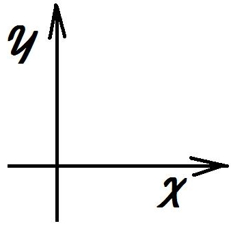
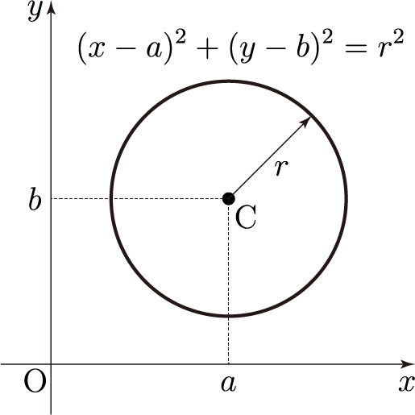

# 3강. C++ 언어의 기초(2)

## 1. 흐름제어 구문

#### (1) 흐름제어 구문의 종류

- 조건문
  - 지정된 조건에 따라 실행 흐름을 제어하는 문장
  - `if`문, `switch`문
- 반복문
  - 정해진 범위의 문장을 반복적으로 실행하게 하는 문장
  - `for`문, `while`문, `do ... while`문

#### (2) 조건문 - if (1/3)

- if문 사용 형식

  ```c++
  if(조건)
      문장; // 조건이 참일 때 실행할 문장
  else 
      문장2; // 조건이 거짓일 때 실행할 문장
  ```

  ```c++
  if(조건)
      문장; // 조건이 참일 때 실행할 문장
  ```

#### (2) 조건문 - if (2/3)

- 예 : 변수 a와 b에 저장된 값 중 큰 값을 출력하기

  ```c++
  if (a > b)
      cout << a << endl;
  else 
      cout << b << endl;
  ```

#### (2) 조건문 - if(3/3)

- 예 : 변수 a와 b에 저장된 값 중 큰 값을 a에, 작은 값을 b에 저장하기

  ```c++
  if(a < b) {
      int temp = a; // temp는 블록 내의 지역변수
  	a = b;
  	b = temp;
  }
  ```

#### (3) 조건문 - switch (1/2)

- switch문 사용 형식

  ```c++
  switch (정수형_수식) {
      case 값1 :
          문장1; // 정수형_수식 == 값1 일 때 실행할 문장들 나열
          break; // switch문을 빠져 나가게 함
      case 값2 :
          문장2; // 정수형_수식 == 값2 일 때 실행할 문장들 나열
          break; // switch문을 빠져 나가게 함
  		......
      default  : // 정수형_수식의 값과 일치하는 case 값이
          문장n; // 없을 때 실행할 문장들을 나열
  }
  ```

#### (3) 조건문 - switch (2/2)

- 예 : int형 변수 score의 값에 따라 A~F의 학점 부여하기

  ```c++
  switch(score / 10) {
      case 10:				// score가 100인 경우
      case 9:
          grade = 'A';		// score가 90~99인 경우
          break;
      case 8:
          grade = 'B';		// score가 80~89인 경우
          break;
      case 7:
          grade = 'C';		// score가 70~79인 경우
          break;
      case 6:
          grade = 'D';		// score가 60~69인 경우
          break;
      default: 
          grade = 'F';		// score가 59 이하인 경우
  }
  ```

#### (4) 반복문 - for 루프 (1/4)

- for문 사용 형식

  ```c++
  for (초기화_문장; 반복조건; 증감_문장)
  	반복할_문장;
  ```

  

  > 출처 : http://tcpschool.com/javascript/js_control_loop

#### (4) 반복문 - for 루프 (2/4)

- 예 : 10개의 정수 값을 읽어 합을 구하기

  ```c++
  int val, total = 0;
  for(int i = 0; i < 10; i++) {
      cin >> val;
      total += val;
  }
  ```

#### (4) 반복문 - for 루프 (3/4)

- 범위 기반 for 루프 `(C++11 이후)`

  ```c++
  for(원소선언: 데이터집합)
      반복할_문장;
  ```

- 예 : 배열 안에 모든 값을 합산하기

  ```c++
  int arr[5] = {2,3,9,4,7};
  int sum = 0;
  for(int a : arr) { // 같은 자료형으로 원소 선언
      sum += a;
  }
  cout << "합계 = " << sum << endl; 
  ```

#### (4) 반복문 - for 루프 (4/4)

- 예 : 배열 안의 모든 값을 1씩 증가시키기

  ```c++
  int arr[10] = {1,2,3,4,5,6,7,8,9,10};
  for(int a : arr)
      ++a;
  // 위와같은 코드는 값을 참조하는 것이기 떄문에 아무리 해도 값이 변하지 않는다.
  int arr[10] = {1,2,3,4,5,6,7,8,9,10};
  for(int& a : arr) // 주소를 참조해서 해당하는 주소의 값을 변경해주기
      ++a;
  ```

#### (5) 반복문 - while 루프 (1/2)

- while문 사용 형식

  ```c++
  while(반복조건)
  	반복할_문장;
  ```

  

> 출처 : http://soen.kr/lecture/ccpp/cpp1/4-3-2.htm

#### (5) 반복문 - while 루프 (2/2)

- 예 : for 루프를 while 루프로 표현하기

  ```c++
  int val, total = 0;
  for(int i = 0; i < 10; i++) {
      cin >> val;
      total += val;
  }
  
  // 위에는 for문
  
  // 아래는 while문
  
  int val, total = 0;
  int i = 0;
  while(i < 10) {
      cin >> val;
      total += val;
      i++;
  }
  ```

#### (6) 반복문 - do ... while 루프 (1/1)

- while문 사용 형식

  ```c++
  do {
  	반복할_문장;	
  } while(반복조건);
  ```

  


## 2. 구조체와 클래스

#### (1) 구조체 (1/10)

- 구조체란?

  - 여러 가지 자료형의 데이터 집합을 저장할 수 있는 `새로운 자료형을 정의한 것`

- 구조체 선언문 형식

  ```c++
  struct structName {
      Type1 item1;
      Type2 item2;
      .....
  };
  ```

#### (1) 구조체 (2/10)

- 구조체의 예

  - 2차원 좌표

  

  > 출처 : https://armishel.tistory.com/365

  ```c++
  struct C2dType {
      double x, y;
  };
  ```

  - 원

    

    > 출처 : [https://namu.wiki/w/%EC%9B%90(%EB%8F%84%ED%98%95)/%EB%B0%A9%EC%A0%95%EC%8B%9D](https://namu.wiki/w/원(도형)/방정식)

    ```c++
    struct CircleType {
        C2dType center; // 구조체를 타입부분에 넣어줄 수 있다.
        double radius;
    };
    ```

  #### (1) 구조체 (3/10)

  - 원의 면적 구하기

    ```c++
    const double PI = 3.141593;
    double circleArea(CircleType c) {
        return c.radius * c.radius * PI;
    }
    ```

  #### (1) 구조체 (4, 5/10)

   - 구조체 활용 예제 - Circle1.cpp

      - 두 원의 중첩 여부 판별

         - 두 원의 중심 거리 계산

           ```c++
           bool chkOverlap(CircleType c1, CircleType c2) {
           	double dx = c1.center.x - c2.center.x;
           	double dy = c1.center.y - c2.center.y;
           	double dCntr = sqrt(dx * dx + dy * dy);
           	return dCntr < c1.radius + c2.radius;    
           }
           
           if(dCntr < c1.radius + c2.radius) 
               // 두 원이 중첩됨
           else 
               // 두 원이 중첩되지 않음
           ```

  #### (1) 구조체 (6/10)

  ```c++
  #include <iostream>
  #include <cmath>
  using namespace std;
  
  const double PI = 3.141593;
  
  struct C2dType { // 2차원 좌표 구조체
  	double x, y;
  };
  
  struct CircleType { // 원 구조체
  	C2dType center;	// 중심 좌표
  	double radius;	// 반경
  };
  ```

  #### (1) 구조체 (7/10)

  ```c++
  double circleArea(CircleType c) {
  	return c.radius * c.radius * PI;
  }
  
  bool chkOverlap(CircleType c1, CircleType c2) {
  	double dx = c1.center.x - c2.center.x;
  	double dy = c1.center.y - c2.center.y;
  	double dCntr = sqrt(dx * dx + dy * dy);
  	return dCntr < c1.radius + c2.radius;
  }
  ```

  #### (1) 구조체 (8/10)

  ```c++
  void dispCircle(CircleType c) {
  	cout << " 중심 : (" << c.center.x << ", " << c.center.y << ")";
  	cout << " 반경 : " << c.radius << endl;
  }
  ```

  #### (1) 구조체 (9, 10/10)

  ```c++
  int main() {
  	CircleType c1 = { {0,0}, 10 }; // 중심 (0, 0), 반경 10으로 초기화
  	CircleType c2 = { {30, 10}, 5 }; // 중심 (30, 10), 반경 5로 초기화
  
  	cout << "원1" << endl;
  	dispCircle(c1);
  	cout << " 원1의 면적 : " << circleArea(c1) << endl;
  	cout << "원2" << endl;
  	dispCircle(c2);
  	cout << " 원2의 면적 : " << circleArea(c2) << endl;
  
      // 두 원의 중첩 여부 출력 
  	if (chkOverlap(c1, c2))
  		cout << "두 원은 중첩됩니다." << endl;
  	else
  		cout << "두 원은 중첩되지 않습니다." << endl;
  	return 0;
  }
  ```

  #### (1) 구조체 전체코드

  ```c++
  #include <iostream>
  #include <cmath>
  using namespace std;
  
  const double PI = 3.141593;
  
  struct C2dType { // 2차원 좌표 구조체
  	double x, y;
  };
  
  struct CircleType { // 원 구조체
  	C2dType center;	// 중심 좌표
  	double radius;	// 반경
  };
  
  double circleArea(CircleType c) {
  	return c.radius * c.radius * PI;
  }
  
  bool chkOverlap(CircleType c1, CircleType c2) {
  	double dx = c1.center.x - c2.center.x;
  	double dy = c1.center.y - c2.center.y;
  	double dCntr = sqrt(dx * dx + dy * dy);
  	return dCntr < c1.radius + c2.radius;
  }
  
  void dispCircle(CircleType c) {
  	cout << " 중심 : (" << c.center.x << ", " << c.center.y << ")";
  	cout << " 반경 : " << c.radius << endl;
  }
  
  int main() {
  	CircleType c1 = { {0,0}, 10 }; // 중심 (0, 0), 반경 10으로 초기화
  	CircleType c2 = { {30, 10}, 5 }; // 중심 (30, 10), 반경 5로 초기화
  
  	cout << "원1" << endl;
  	dispCircle(c1);
  	cout << " 원1의 면적 : " << circleArea(c1) << endl;
  	cout << "원2" << endl;
  	dispCircle(c2);
  	cout << " 원2의 면적 : " << circleArea(c2) << endl;
  
  
  	// 두 원의 중첩 여부 출력 
  	if (chkOverlap(c1, c2))
  		cout << "두 원은 중첩됩니다." << endl;
  	else
  		cout << "두 원은 중첩되지 않습니다." << endl;
  	return 0;
  }
  ```

  

  ----

  #### (2) 클래스 (1/5)

  - 클래스란?
    - 표현 대상이 어떤 일을 할 수 있는가(`행위`)와 어떤 데이터를 저장하는가(`속성`)를 하나의 단위로 묶어 선언한 것
    - 예 : `'원' `클래스
    - 행위 
      - init : 원의 초기화
      - area : 원의 면적을 계산
      - chkOverlap : 다른 원과 중첩 여부 검사
      - display : 원의 정보 디스플레이
    - 속성
      - center : 중심 좌표
      - radius : 반경

  #### (2) 클래스 (2/5)

  ```c++
  class CircleClass { // 원 클래스
  	C2dType center; // 중심 좌표 	- 속성
  	double radius;	// 반경 		  - 속성
  
  public :
      void init(double cx, double cy, double r) {...} 	// - 행위
      double area() const {...}							// - 행위
      bool chkOverlap(const CircleClass& c) const {...}	// - 행위
      void display() const {...}							// - 행위
      
  };
  ```

  #### (2) 클래스 (3/5)

  ```c++
  class CircleClass { // 원 클래스
      // ......
  	// 원의 면적 계산
  	double area() const {
  		return radius * radius * PI;
  	}
  
  	bool chkOverlap(const CircleClass& c) const {
  		double dx = c.center.x - c.center.x;
  		double dy = c.center.y - c.center.y;
  		double dCntr = sqrt(dx * dx + dy * dy);
  	}
      // ......
  };
  ```

  #### (2) 클래스 (4, 5/5)

  ```c++
  int main() {
      CircleClass c1, c2;
      c1.init(0, 0, 10); // 중심 (0, 0), 반경 10으로 초기화
      c2.init(30, 10, 5);	// 중심 (30, 10), 반경 5로 초기화
  
      cout << "원1" << endl;
      c1.display();
      cout << "원1의 면적 : " << c1.area() << endl;
      cout << "원2" << endl;
      c2.display();
      cout << "원2의 면적 : " << c2.area() << endl;
  
      // 두 원의 중첩 여부 출력 
      if (c1.chkOverlap(c2))
      cout << "두 원은 중첩됩니다." << endl;
      else
      cout << "두 원은 중첩되지 않습니다." << endl;
      return 0;
  }
  ```

  #### (2) 클래스 전체 코드

  ```c++
  #include <iostream>
  #include <cmath>
  using namespace std;
  
  const double PI = 3.141593;
  
  struct C2dType {	// 2차원 좌표 구조체
  	double x, y;
  };
  
  class CircleClass { // 원 클래스
  	C2dType center; // 중심 좌표
  	double radius;	// 반경
  
  public :
  	// 중심 (cx, cy), 반경 r로 원을 초기화
  	void init(double cx, double cy, double r) {
  		center.x = cx;
  		center.y = cy;
  		radius = r;
  	}
  	
  	// 원의 면적 계산
  	double area() const {
  		return radius * radius * PI;
  	}
  
  	bool chkOverlap(const CircleClass& c) const {
  		double dx = c.center.x - c.center.x;
  		double dy = c.center.y - c.center.y;
  		double dCntr = sqrt(dx * dx + dy * dy);
  	}
  
  	// 원 객체의 정보 디스플레이
  	void display() const {
  		cout << " 중심 : (" << center.x << ", " << center.y << ")";
  		cout << " 반경 : " << radius << endl;
  	}
  
  	int main() {
  		CircleClass c1, c2;
  		c1.init(0, 0, 10); // 중심 (0, 0), 반경 10으로 초기화
  		c2.init(30, 10, 5);	// 중심 (30, 10), 반경 5로 초기화
  
  		cout << "원1" << endl;
  		c1.display();
  		cout << "원1의 면적 : " << c1.area() << endl;
  		cout << "원2" << endl;
  		c2.display();
  		cout << "원2의 면적 : " << c2.area() << endl;
  
  		// 두 원의 중첩 여부 출력 
  		if (c1.chkOverlap(c2))
  			cout << "두 원은 중첩됩니다." << endl;
  		else
  			cout << "두 원은 중첩되지 않습니다." << endl;
  		return 0;
  	}
  
  };
  ```

  ---

  #### (3) 구조체와 클래스의 비교

  - 구조체 활용
    - 데이터만으로 구성되서 별개의 함수를 만들어 사용했다.
  - 클래스 활용
    - 하나의 단위로 묶어 데이터를 개별적으로 사용하는게 아니라 함수를 통해서 일관된 방법으로 데이터를 활용할 수 있게 해준다.

## 3. 배열

#### (1) 배열의 개념

- 배열이란?
  - `동일한 자료형의 값`을 여러 개 저장할 수 있는 `연속적으로 할당된 공간`을 묶어 하나의 이름을 갖는 변수로 만든 것
  - 각가의 원소는 `0번부터 시작`하여 차례로 부여된 `번호(첨자, 인덱스)`를 이용하여 액세스 함
  - 배열의 차원 : 배열의 첨자 개수

#### (2) 1차원 배열

- 1차원 배열의 선언

  ```c++
  float fArray[4]; // 4개의 값을 저장할 수 있는 float형 배열이다.
  // fArray[0], fArray[1], fArray[2], fArray[3]
  ```

- 1차원 배열의 사용

  ```c++
  float fArray[4];
  int i = 0;
  fArray[i] = 10.0f;
  cin >> fArray[1] >> fArray[2] >> fArray[3];
  cout << farray [1] * fArray[2];
  ```

#### (3) 다차원 배열

- n차원 배열

  - n-1차원 배열이 원소인 배열

    ex) 2차원 배열 - 1차원 배열이 원소인 배열

    ex) 3차원 배열 - 2차원 배열이 원소인 배열 ....

  - 2차원 배열

    ```c++
    int Arr2D[4][3];
    ```

    아래와 같이 표현할 수 있다.

    | Arr2D\[0\]\[0\] | Arr2D\[0\]\[1\] | Arr2D\[0\]\[2\] |
    | --------------- | --------------- | --------------- |
    | Arr2D\[1\]\[0\] | Arr2D\[1\]\[1\] | Arr2D\[1\]\[2\] |
    | Arr2D\[2\]\[0\] | Arr2D\[2\]\[1\] | Arr2D\[2\]\[2\] |
    | Arr2D\[3\]\[0\] | Arr2D\[3\]\[1\] | Arr2D\[3\]\[2\] |

  - 행 우선 순서(row-major order) 저장

#### (4) 배열의 활용 (1/3)

- 배열의 초기화

  ```c++
  int a[5] = { 1,2,3,4,5 }; // `=`는 생략할 수 있음.
  int b[5] = { 1,2,3 };  	  // b[3]와 b[4]는 0으로 초기화 됨
  int c[] = { 1,2,3,4,5 };  // 배열의 크기는 입력된 값의 길이만큼 자동으로 계산되어 5가 된다.
  int d[2][4] = {{1,2,3,4}, {5,6,7,8}}; // 2차원 배열의 초기화
  ```

#### (4) 배열의 활용 (2/3)

- 여러 개의 데이터 중 최댓값 구하기

  - 일반 변수를 사용한 프로그램 

    ```c++
    max = data0;
    if(max < data1) max = data1;
    if(max < data2) max = data2;
    if(max < data3) max = data3;
    if(max < data4) max = data4;
    if(max < data5) max = data5;
    if(max < data6) max = data6;
    if(max < data7) max = data7;
    if(max < data8) max = data8;
    if(max < data9) max = data9;
    if(max < data10) max = data10;
    ```

#### (4) 배열의 활용 (3/3)

- 여러개의 데이터 중 최댓값 구하기 - MaxValue.cpp

  ```c++
  #include <iostream>
  using namespace std;
  
  int main() {
  	int max;
  	int data[10] = { 10, 23, 5, 9, 22, 49, 12, 10, 55, 31 };
  
  	max = data[0]; // data의 0번값을 max로 가정
  	// cout << "데이터 : " << data[0];	// 0번 데이터 출력
  	cout << "max 데이터 : " << max;	// 0번 데이터 출력
  	for (int i = 1; i < 10; i++) { // 나머지 9개의 데이터 비교
  		cout << "\n 현재 max 데이터 " << max;	// i번 데이터 출력
  		if (max < data[i]) max = data[i]; // i번 데이터 비교
  	}
  	cout << "\n\n배열의 최댓값 : " << max << endl;
  	return 0;
  }
  ```

  

## 4. 포인터와 동적 메모리 할당

#### (1) 포인터의 활용 (1/3)

- 포인터란?

  - 다른 변수, 구조체, 객체 등 값이 저장된 곳을 가리키는 변수

- 포인터 선언 형식

  ```C++
  TypeName *ptrVar;
  ```

  - TypeName : 가리킬 값의 자료형
  - prtVar : 포인터 변수의 이름
  - ex ) int *iPtr; // iPtr이라는 변수는 정수형 값이 저장되어 있는 곳을 가리키는 포인터이다.

#### (1) 포인터의 활용 (2/3)

- 포인터의 사용

  ```c++
  ptrVar = &var;
  *ptrVar = value;
  ```

  - & : 주소 계산 연산자
  - *ptrVar : 포인터 ptrVar가 가리키는 곳

#### (1) 포인터의 활용 (3/3)

- 포인터의 사용 예 - SimplePt.cpp

  ```c++
  #include <iostream>
  using namespace std;
  
  int main() {
  	int a = 10;
  	int* ptr;
  
  	ptr = &a;	// ptr에 a의 주소를 넣음
  	cout << "ptr가 가리키는 값 : " << *ptr << endl;
  	*ptr = 20;
  	cout << "\n변수 a의 값 : " << a << endl;
  	return 0;
  }
  ```

#### (2) 동적 메모리 할당 (1/4)

- 동적 메모리 할당이란 ?
  - 프로그램 동작 중에 기억공간의 필요성 및 소요량을 결정하여 필요한 공간을 할당하는 것
    - 기억공간의 생성 시점 : `new 연산자의 실행 시점`
    - 기억공간의 소멸 시점 : `delete 연산자의 실행 시점`
  - `포인터 변수`가 할당된 기억 공간을 가리키게 함

#### (2) 동적 메모리 할당 (2/4)

- 메모리 할당 연산자

  ```c++
  1. ptrVar = new TypeName;
  2. ptrVar = new TypeName[n]; // n은 정수형 수식이며, ptrVar은 TypeName[0]번째를 가리킨다.
  ```

- 메모리 반납 연산자

  ```c++
  1. delete ptrVar;
  2. delete [] ptrVar;
  ```

#### (2) 동적 메모리 할당 (3/4)

- 단일 데이터 공간의 할당 및 반환

  ```c++
  int *intPtr;	  // 포인터 선언
  intPtr = new int; // 메모리를 할당
  *intPtr = 10;     // 포인터에 값을 대입
  cout << *intPtr << endl;	
  // ....
  delete intPtr;	// 메모리를 시스템에 반납
  // 반납을 해도 intPtr은 계속 해당 위치를 가리키고 있다.
  // 이 포인터가 아무것도 가리키고 있지 않다 라는 것을 아래와 같이 쓸 수 있다.
  intPtr = nullptr; // 포인터에 넣어주는 null 값이다. 기억하자
  ```

#### (2) 동적 메모리 할당 (4/4)

- 배열 데이터 공간의 할당 및 반환

  ```c++
  int *intPtr;
  intPtr = new int[4]; // intPtr은 int[0]을 가리킨다.
  *intPtr = 10;
  *(intPtr + 1) = 20;	// 다음 위치를 (intPtr + 1)로 표현할 수 있다.
  intPtr[2] = 30; // 이와 같은 형태로도 사용할 수 있다.
  // ......
  delete [] intPtr; // 배열 포인터를 반납
  intPtr = nullptr;
  ```

## 5. 참조

#### (1) l-value 참조 (1/4)

- 참조(reference)란?

  - 어떠한 대상을 가리키는 값(포인터와 유사함)
  - 참조 변수는 `참조 대상의 별명처럼 사용할 수 있음`
  - l-value 참조 : `실체가 있는 대상(l-value)에 대한 참조`

- l-value 참조 변수의 선언 형식

  ```c++
  TypeName &refVar = varName;
  x = y;
  // 대입연산자를 기준으로 
  // x를 l-value (값을 저장해주는 실체가 있어야 함)
  // y를 r-value (값을 제공해주기만 하는 역할)
  ```

  - TypeName : 참조 대상의 자료형
  - refVar : 참조 변수의 이름
  - varName : 참조 대상

- `l-value 참조는 반드시 초기화를 통해서만 대상이 지정해져야만 한다.`

#### (1) l-value 참조 (2/4)

- l-value 참조 변수의 사용 예

  ```c++
  int a = 10, b = 20;
  int &aRef = a;		// 참조의 초기화
  cout << aRef << endl; // aRef는 a 와 같다.
  aRef = 100;			// a = 100;
  aRef = b;			// a = b;
  ```

- 포인터를 사용한 예

  ```c++
  int a = 10, b = 20;
  int *aPtr = &a;
  cout << *aPtr << endl;
  *aPtr = 100;
  *aPtr = b;
  ```

#### (1) l-value 참조 (3/4)

- 참조를 이요하여 참조 대상의 값을 바꿀 수 없음

  ```c++
  int x { 10 };
  const int &xRef = x;
  cout << xRef << endl; // x의 값을 읽어 출력함
  xRef += 10; // 오류: const 참조로 값을 수정할 수 없음
  ```

#### (1) l-value 참조 (4/4)

- 참조 변수가 포인터와 다른 점
  - 참조 변수를 이용하여 `값을 읽거나 저장할 때 일반 변수를 사용하는 형식과 동일함`
  - 참조 변수는 초기화를 통해 반드시 어떤 대상을 참조해야 함
    - 아무것도 참조하지 않는 상황은 발생하지 않음
  - 참조 변수는 초기화를 통해 지정된 참조 대상을 바꿀 수 없어 참조의 유효기간 동안 하나의 대상만 참조할 수 있음

#### (2) r-value 참조

- r-value 참조란?
  - 사용한 후에는 그 값을 더 이상 가지고 있을 필요가 없는 대상을 참조
- r-value 참조의 용도
  - 객체의 값을 다른 객체로 이동