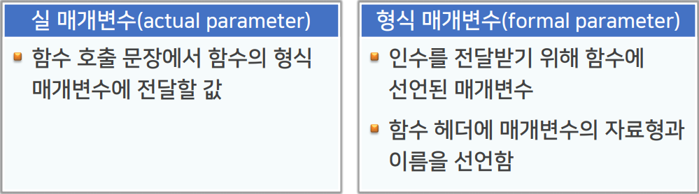
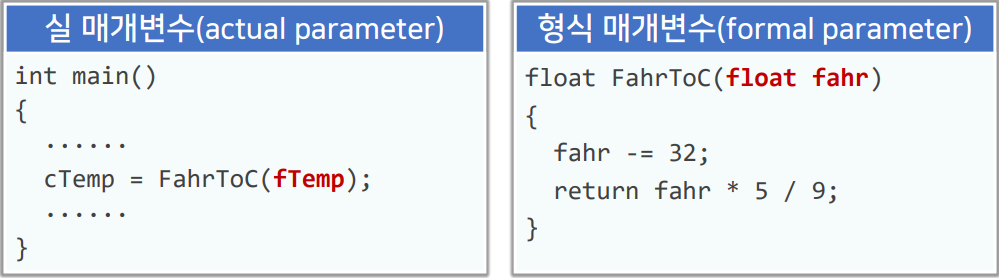
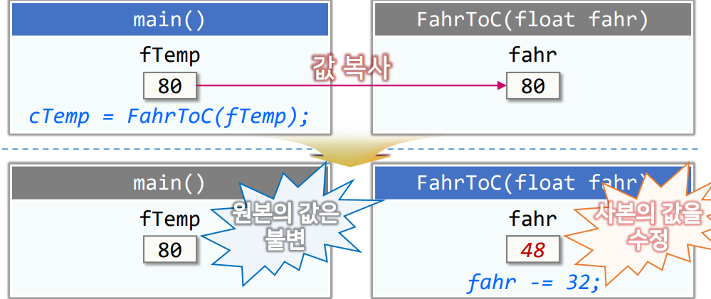

# 4강. 함수

## 1. 함수의 정의와 호출

### (1) 함수의 개념 (1/3)

- 다음 프로그램이 하는 작업은?

  ```c++
  int main() {
  	double a[50], b[100];
      //...... // 생략: a와 b에 각각 50개와 100개의 데이터 입력
      double sum = 0, sqSum = 0;
      for(int i = 0; i < 50; i++) {
          sum += a[i];
          sqSum += a[i] * a[i];
      }
      
      cout << sqSum / 50 - sum * sum / (50 * 50) << endl; // 분산
      sum = sqSum = 0;
      for(int i = 0; i < 100; i++) {
          sum += b[i];
          sqSum += b[i] * b[i];
      }
      
      cout << sqSum / 100 - sum * sum / (100 * 100) < endl;
  }
  ```

### (1) 함수의 개념 (2/3)

- 다음 프로그램이 하는 작업은?

  ```c++
  #include <iostream>
  using namespace std;
  
  double variance(const double arr[], int n) {
  	double sum = 0, sqSum = 0;
  	for (int i = 0; i < n; i++) {
  		sum += arr[i];
  		sqSum += arr[i] * arr[i];
  	}
  	return sqSum / n - sum * sum / (n * n);
  }
  
  int main() {
  	double a[50], b[100];
  
  	for (int i = 0; i < 100; i++) {
  		if (i < 50) {
  			a[i] = i;
  		}
  		b[i];
  	}
  	cout << variance(a, 50) << endl;
  	cout << variance(b, 100) << endl;
  }
  ```

### (1) 함수의 개념 (3/3)

- 필요한 작업을 수행하는 프로그램 문장들을 `하나의 단위로 모아 놓고 이름`을 부여한 것
- 함수에 정의된 처리가 필요한 부분에서 `호출`하여 사용함
- `매개변수`를 통하여 함수에서 처리할 `데이터(인수)`를 전달함
- 함수는 정해진 처리를 한 후 결과 값을 `반환`할 수 있음
- 함수의 실행을 완료하면 `호출한 곳으로 복귀(반환)`함
- C++ 프로그램은 `함수를 기본 단위로 하여 구성됨`

### (2) 함수 사용 형식 (1/3)

- 함수 정의 형식

  ```c++
  ReturnType functionName(fParameterList) // 머리부
  {	// 몸체 블록
  	Type1 LocalVar1; // 지역변수 선언
     	Type2 LocalVar2;
  	// ......
      statement1; // 처리할 작업을 수행하는 문장
      statement2;
      // ......
      return returnExpression;	// 결괏값을 반환
  }
  ```

  - fParameterList : `인수를 받기 위한 형식 매개변수 선언`
  - ReturnType : 함수의 결과로 반환하는 값의 자료형
  - returnExpression : 함수의 결과로 반환하는 값

### (2) 함수 사용 형식 (2/3)

- return 명령
  - 함수를 마치고 함수를 호출한 곳으로 복귀하는 명령
  - 함수 안의 어느 곳이든 복귀를 위해 사용할 수 있음
  - returnExpression은 함수 머리부에 선언한 `ReturnType과 일치하는 자료형의 수식` 또는 `묵시적 형 변환이 가능한 자료형의 수식`을 사용함
  - 반환값이 없는 함수의 ReturnType은 `void`로 선언함
  - main 함수에서는 return 명령을 만나지 않은 상태로 함수의 끝에 도달하면 `return 0;`을 실행한 것과 같음

### (2) 함수 사용 형식 (3/3)

- 함수 호출 형식

  

  - aParameterList : 인수로 전달할 실 매개변수 나열
  - 형식1 : 반환값 유무에 관계 없이 사용 가능함
  - 형식2 : ReturnType이 void가 아닌 함수에 사용할 수 있음

### (3) 함수 사용 예 - ConvFtoC.cpp (1/2)

```c++
#include <iostream>
using namespace std;

// 화씨온도를 섭씨온도로 변환하는 함수
// 매개변수 	 float fahr : 화씨온도
// 반환값 		  섭씨온도(float)
float FahrToC(float fahr)
{
	return (fahr - 32) * 5 / 9;
}
int main()
{
	······
}
```

### (3) 함수 사용 예 - ConvFtoC.cpp (2/2)

```c++
float FahrToC(float fahr) // 형식 매개변수
{
	return (fahr - 32) * 5 / 9;
}
int main()
{
	float fTemp, cTemp;
	cout << "화씨온도 : ";
	cin >> fTemp;
	cTemp = FahrToC(fTemp); // 함수 호출 실 매개변수
	cout << "---> 섭씨온도 : " << cTemp << endl;
	return 0;
}
```


### (4) 함수의 원형

````c++
float FahrToC(float fahr); // 함수의 원형 (리턴타입, 함수의이름, 함수의 형식 매개변수)

int main()
{
	float fTemp, cTemp;
	cout << "화씨온도 : ";
	cin >> fTemp;
	cTemp = FahrToC(fTemp); // 함수 호출
	cout << "---> 섭씨온도 : " << cTemp << endl;
	return 0;
}

float FahrToC(float fahr)
{
	return (fahr - 32) * 5 / 9;
}

````

### (5) 함수 사용에 따른 장점과 단점

- 장점 
  - 의미 있는 작업 단위로 모듈화
    - 간결하고 이해하기 쉬운 프로그램을 나들 수 있음
  - 반복 사용되는 코드의 `중복 방지`
  - 잘 설계된 함수는 다른 응용에서 `재사용` 할 수 있음
- 단점
  - `함수 호출과 복귀 과정에서 처리 시간이 추가됨`
    - 매우 효율적으로 동작해야 하는 함수라면 `inline 함수`로 선언함


## 2. 인수의 전달

### (1) 인수와 매개변수 (1, 2/2)

- 인수

  - 함수 호출 문장에서 함수에 전달하는 값
  - 매개변수를 통해 인수를 전달함

  

  

### (2) 인수 전달 방식 (1, 2/6)

- 값 호출 (call-by-value)

  - 실 매개변수의 값을 형식 매개변수에 복사함

    

  - 장점 

    - 실 매개변수와 형식 매개변수는 별개의 데이터 이므로 불필요한 부작용이 발생하지 않음

  - 단점

    - 구조체와 같이 많은 양의 데이터로 구성된 인수를 전달할 경우 데이터의 복사량이 많아짐

### (2) 인수 전달 방식 (3/6)

- 참조 호출(call-by-reference)
  - 실 매개변수의 참조를 형식 매개변수에 전달함
  - 함수에서 형식 매개변수의 값을변경하는 것은 실 매개변수의 값을 변경하는 것과 같음
  - 형식 매개변수에 복사되는 데이터의 양은 실 매개변수의 크기와 관계 없이 일정함
    - 많은 양의 데이터로 구성되는 구조체나 객체를 인수로 전달하는 경우 효율적임

### (2) 인수 전달 방식 (4, 5/6)

- 참조 호출의 예 - SwapInt.cpp

  ```c++
  #include <iostream>
  using namespace std;
  
  void SwapValues(int& x, int& y);	// 원형
  
  int main()
  {
  	int a, b;
  
  	cout << "두 수를 입력하시오 : ";
  	cin >> a >> b;
  	if (a < b) SwapValues(a, b); // 순서를 바꿔 a에 큰 값을 넣음
  	cout << "큰 수 = " << a << " 작은 수 = " << b << endl;
  	return 0;
  }
  
  void SwapValues(int& x, int& y) 
  {
  	int temp = x;
  	x = y;
  	y = x;
  }
  ```

### (2) 인수 전달 방식 (6/6)

- 참조 호출을 통한 효율적인 인수 전달
  - 많은 양의 데이터로 구성되는 구조체나 객체를 인수로 전달하는 경우 값 호출을 사용하는 것에 비해 참조 호출을 사용하는 것이 효율적임
  - 함수 호출의 효율성을 위해 참조 호출을 하지만 실 매개변수의 값이 변경되는 것을 원하지 않는 `형식 매개변수에는 const를 한정어를 지정`하여 실 매개변수를 보호

### (3) const 매개변수 (1/3)

- const 한정어를 이용한 실 매개변수 보호 - PrintRec.cpp

  ```c++
  struct SalesRec {
      char pID[10];
      int dYear, dMonth, dDate;
      char deliverAddr[40];
  }
  
  // void PrSalesRec(SalesRec srec) 
  
  // ↓↓↓↓↓↓↓↓↓↓↓↓↓↓↓↓↓
  
  // void PrSalesRec(SalesRec &srec) // 4바이트 복사
  
  // ↓↓↓↓↓↓↓↓↓↓↓↓↓↓↓↓↓
  
  void PrSalesRec(const SalesRec &srec)
  {
      cout << "품목코드 : " << srec.pID << endl;
      cout << "배달일자 : " << srec.dYear << "년 ";
      cout << srec.dMonth << "월 ";
      cout << srec.dDate << "일" << endl;
     	cout << "배달주소 : " << srec.deliverAddr << endl;
  }
  ```

### (4) 디폴트 인수 (1/4)

- 인수의 디폴트 값을 지정하는 방법

  - 일반적으로 사용되는 디폴트 값이 있는 인수의 경우 함수를 정의할 때 그 값을 미리 지정할 수 있음

  - 예)

    ```c++
    istream& get(char* pch, int max, char delim='\n');
    
    char str[10];
    cin.get(str, 10); // cin.get(str, 10, '\n')과 동일
    // str문자가 9를 못넘김 마지막에 null값이 들어와야 함 '\0';
    ```

### (4) 디폴트 인수 (2, 3/4)

- 예 : 반올림 함수 Round() - Round.cpp

  ```c++
  // ......
  double Round(double x, int d = 0);
  
  int main()
  {
      double a;
      cout << "값 = ";
      cin >> a;
      cout << "반올림 --> " << Round(a) << endl;
      cout << "           " << Round(a, 1) << endl;
      cout << "           " << Round(a, 2) << endl;
      cout << "           " << Round(a, 3) << endl;
      return 0;
  }
  
  double Round(double x, int d) // 함수의 원형에서 디폴트 값을 적어놨다면 형식매개변수에는 디폴트 값을 적을 수 없다. 디폴트 값은 한번만 적을 수 있다.
  {
      double a = x >= 0 ? 0.5 : -0.5;
      double pow10 = pow(10, d);
      return trunc(x * pow10 + a) / pow10;
  }
  ```

### (4) 디폴트 인수 (4/4)

- 주의 사항

  - 디폴트 인수는 인수 중 끝에만 위치할 수 있음

  - 예

    ```c++
    void f(int x, int y = 10, int z = 20); // OK
    void g(int x, int y = 10, int z); // 오류
    // 디폴트 값은 무조건 뒤쪽에만 있어야한다. 안그러면 z의 값을 추론하기 어려움
    
    f(5);			// x = 5, y = 10, z = 20 전달
    f(5, 100);		// x = 5, y = 100, z = 20 전달
    f(5, 100, 200);	// x = 5, y = 100, z = 200 전달
    f(5, , 300);	// (오류) x = 5, y = 10, z = 300 전달
    f(5, 300); // (x)
    // 디폴트 값을 명시적으로 적어주어야 한다.
    ```

## 3. 함수의 다중정의

### (1) 함수 다중정의의 개념

- 다중정의(overloading)란 ?
  - 동일한 이름에 대하여 여러 가지 의미를 부여하는 것
- 함수 다중정의
  - 동일한 이름을 갖는 함수를 여러 개 정의하는 것
  - 동일한 개념의 처리를 여러가지 데이터나 객체에 대해 각각의 대상에 맞는 처리를 해야 할 경우 사용함
- 다중정의된 함수의 구분 : 인수의 개수 및 자료형
  - 함수의 반환 자료형으로 함수를 구분할 수 없음

### (2) 함수 다중정의의 예 - TimeCalc.cpp (1/4)

- 시간 구조체 TimeRec

  ```c++
  struct TimeRec {
      int hours;
      int minutes;
  };
  ```

  - AddTime() 함수의 다중정의

    ```c++
    void AddTime(TimeRec& t1, const TimeRec& t2); // t1에 t2를 더한다.
    void AddTime(timeRec& t, int minutes);
    ```

### (2) 함수 다중정의의 예 - TimeCalc.cpp (2/4)

```c++
// ......
struct TimeRec {
    int hours;
    int minutes;
}

// 시간을 더하는 함수
// 인수 TimeRec &t1			: 누계할 시간
// 		const TimeRec &t2	  : 더할 시간
// 반환값 없음
void AddTime(TimeRec &t1, const TimeRec &t2)
{
    t1.minutes += t2.minutes;
    t1.hours += t2.hours + t1.minutes / 60;
    t1.minutes %= 60;
}
```

### (2) 함수 다중정의의 예 - TimeCalc.cpp (3/4)

```c++
// ......
void AddTime(TimeRec &t1, const TimeRec &t2)
{
    t1.minutes += t2.minutes;
    t1.hours += t2.hours + t1.minutes / 60;
    t1.minutes %= 60;
}

void AddTime(TimeRec &t1, int minutes)
{
    t.minutes += minutes;
    t.hours += t.minutes / 60;
    t.minutes %= 60;
}
```

### (2) 함수 다중정의의 예 - TimeCalc.cpp (4/4)

```c++
int main() 
{
	TimeRec tRec1 = { 2, 30 };
    TimeRec tRec2 = { 1, 45 };
    
    cout << tRec1.hours << "시간 " << tRec1.minutes << "분 + ";
    cout << tRec2.hours << "시간 " << tRec2.minutes << "분 = ";
    AddTime(tRec1, tRec2);
    cout << tRec1.hours << "시간 " << tRec1.minutes << "분" << endl;
    
    cout << tRec1.hours << "시간 " << tRec1.minutes << "분 + ";
	cout << "135분 = ";
    AddTime(tRec1, 135);
    cout << tRec1.hours << "시간 " << tRec1.minutes << "분" << endl;
    return 0;
}
```

### (3) 주의 : 모호한 함수 다중정의 (1/3)

```c++
void f(int a) {
    cout << a * a;
}

/* error */
void f(int a, int b) {
    cout << a * b;
}

/* error */
int f(int a, int b) {
    cout << a * b;
}

int main() {
    f(10);
    f(10, 20);
}
```

- 함수의 반환 자료형만 다르면 분석할 수 없음

### (3) 주의 : 모호한 함수 다중정의 (2/3)

```c++
void g(int a)
{
    cout << a * a;
}

void g(int a, int b = 100)
{
    cout << a * b;
}

int main() 
{
    g(10, 20);
    g(10); // 에러 선택 기준이 모호함
    // ......
}
```

### (3) 주의 : 모호한 함수 다중정의 (2/3)

```c++
void h(int a)
{
    cout << a * a;
}

void h(float a) 
{
    cout << a * b;
}

int main()
{
    h(10); // int
    h(10,0f); // float
    h(10.0); // 에러 : 형변환 대상이 모호함
}
```


## 4. inline 함수

### (1) inline 함수의 개념 (1/2)

- inline 함수란?
  - 함수 호출 절차를 따르지 않고함수 호출 위치에 함수의 처리 문장이 삽입되게 번역하도록 선언된 함수
  - 함수를 사용함으로써 얻을 수 있는 모듈화의 장점을 살리면서,함수 호출에 따른 `부수적인 처리시간이 생략됨`
  - 함수 호출 루틴으로부터 함수로 넘어간느 부분의 `코드 최적화가 가능`해짐
    - `매우 빈번히 허출되며 빠른 실행이 요구되 함수의 inline함수로 선언하면 성능을 높이는데 도움이 됨`

### (1) inline 함수의 개념 (2/2)

- 주의 
  - inline 함수로 선언하더라도 반드시 inline으로 번역되는 것은 아님
  - inline 선언을 무시하고 일반 함수로 번역하는 경우
    - 함수가 너무 큰 경우
    - 순환 호출(recursive call)을 하는 경우
    - 프로그램 내에서 그 함수에 대한 포인터를 사용하는 경우

### (2) inline 함수의 예 - Swaplnline.cpp

```c++
inline void SwapValues(int &x, int &y)
{
    int temp = x;
    x = y;
    y = temp;
}

int main() 
{
    int a, b;
    
    cout << "두 수를 입력하시오 : ";
    cin >> a >> b;
    if(a < b) SwapValues(a, b); // 순서를 바꿔 a에 큰 값을 넣음
    cout << "큰 수 = " << a << " 작은 수 " << b << endl;
    
    return 0;
}
```

