# 5강. 클래스와 객체(1)

## 1. 객체지향 프로그래밍 주요 개념

### (1) 객체

- 객체(object)란?

  - 소프트웨어 시스템 안의 어떠한 대상을 표현한 것으로

    - 정해진 처리를 수행함 → 행위, 메소드, 멤버함수

    - 처리 과정에 따라 내부 상태가 변화할 수 있음 → 속성, 데이터 멤버

    - 다른 객체와 상호작용 할 수 있음 → 메시지 전달(멤버함수 호출)

      

### (2) 클래스

- 객체의 설계도

- 객체가 포함할 속성에 대한 명세와 메소드의 정의를 포함함

  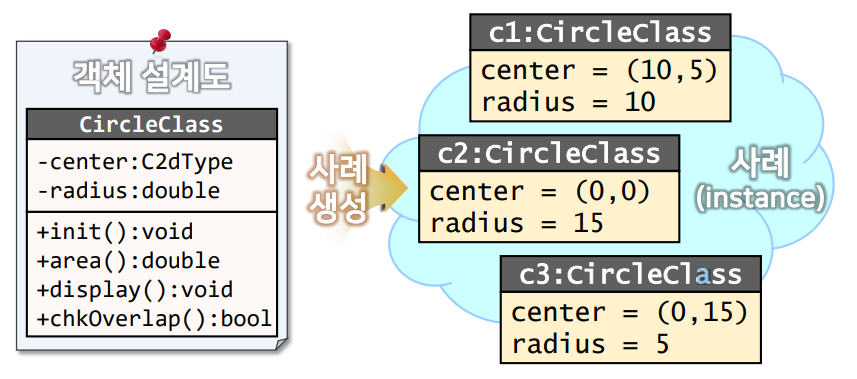

### (3) 캡술화 (1/3)

- 캡슐화(encapsulation)란?

  

  - TV를 구동하는 회로는 내부에 감춤

  - 시청자는 외부에 마련된 조작 단추(인터페이스)를 이용하여 TV를 시청함

  - 즉, 객체 내부의 상세한 구현 부분과 외부 사용자의 관점을 분리함

    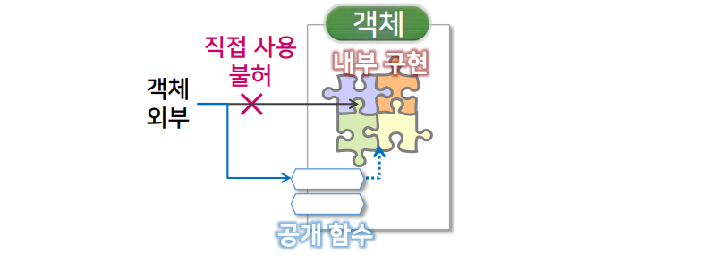

  - 내부 속성 등 구현에 대한 부분은 공개하지 않으며(`정보은닉`), 객체 외부에서는 공개된 인터페이스를 통해 객체를 사용할 수 있음

- 캡슐화의 장점

  - 소프트웨어의 유지보수가 용이함
    - 프로그램의 다른 부분에 영향을 미치지 않고 객체 내부 구현 방법을 수정할 수 있음
  - 재사용이 용이함
    - 잘 설계된 캡슐화된 객체는 다른 응용에서도 재사용할 수 있어 소프트웨어 개발비용을 줄일 수 있음

### (4) 상속

- 클래스의 계층적 설계

  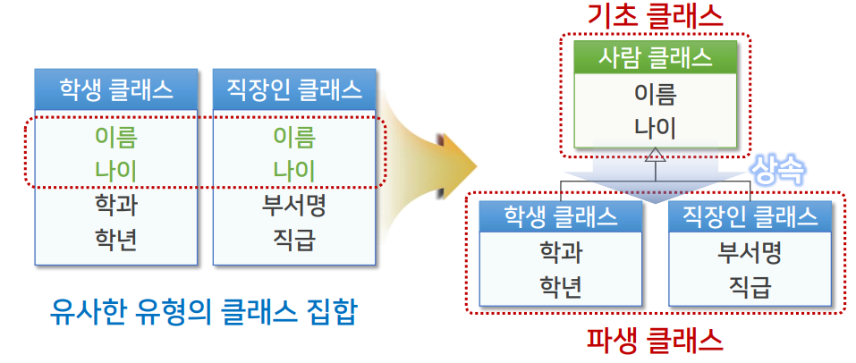

  

## 2. 클래스 선언과 객체 정의

### (1) 클래스 선언 (1/5)

- 클래스

  - 표현하고자 하는 대상의 메소드와 속성을 선언한 것

    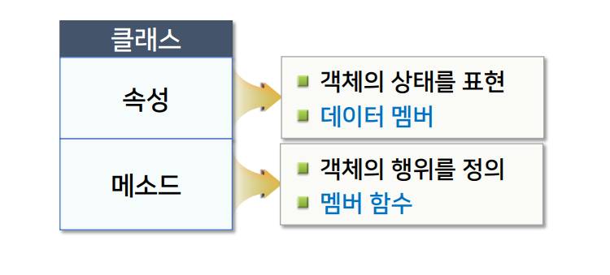

### (1) 클래스 선언 (2/5)

- 클래스 선언문의 형식

  ```c++
  class ClassName {
  가시성_지시어_1:
  	데이터 멤버 또는 멤버함수 리스트;
  가시성_지시어_2:
  	데이터 멤버 또는 멤버함수 리스트;
  	······
  };
  ```

### (1) 클래스 선언 (3/5)

- 클래스의 멤버가 공개되는 범위를 나타냄

- 종류 : private, public, protected(상속과 관련)

  | 가시성 지시어   | 공개 범위                                                    |
  | --------------- | ------------------------------------------------------------ |
  | private(디폴트) | - 소속 클래스의 멤버 함수<br />- 친구 클래스의 멤버 함수 및 친구 함수<br />- 그 외의 범위에는 비공개 |
  | public          | - 전 범위                                                    |

### (1) 클래스 선언 (4/5)

- 클래스의 멤버가 공개되는 범위를 나타냄

- 종류 : private, public, protected(상속과 관련)

  | 가시성 지시어   | 용도                                                         |
  | --------------- | ------------------------------------------------------------ |
  | private(디폴트) | - 정보은닉을 위해 사용됨<br />- 클래스의 구현을 위한 내부 상태 (데이터 멤버)는 일반적으로 private으로 지정함 |
  | public          | 주로 외부에 제공할 인터페이스를 공개하기 위해 사용됨         |

### (1) 클래스 선언 (5/5)

- 예 : '원' 클래스

  ```c++
  class CircleClass {
      C2dType center; // 중심 좌표 - private
      double radius; // 반경 - private
  public:
      void init(double cx, double cy, double r) { ··· }
      double area() const { ··· }
      bool chkOverlap(const CircleClass& c) const { ··· }
      void display() const { ··· }
  };
  ```


### (2) 객체의 정의 및 사용 (1/3)

- 객체 정의 형식

  ```c++
  ClassName objName;
  ClassName objName1, objName2, ......;
  ```

  - 예)

    ```c++
    int main() 
    {
        CircleClass c1, c2;
        ......
    }
    ```

### (2) 객체의 정의 및 사용 (2/3)

- 객체 사용 형식

  - 객체 이름에 멤버 선택 연산자(.)를 사용하여 객체의 멤버를 액세스함

    ```c++
    cin >> objName.dataMember;
    objName.memFunc(......);
    ```

### (2) 객체의 정의 및 사용 (3/3)

- 객체 사용 형식

  - 예

    ```c++
    class CircleClass {
        C2dType center; // 중심 좌표
        double radius; // 반경
    public:
        ······
        bool chkOverlap(const CircleClass& c) const {
            ······
            return dCntr < radius + c.radius;
        }
    };
    ```

    ```c++
    int main() {
        CircleClass c1, c2;
        ......
        if (c1.chkOverlap(c2)) ......
    }
    ```

    

## 3. 예제 - Counter 클래스

### (1) Counter 클래스의 명세

- Counter 클래스

  - 계수기를 나타내는 클래스를 선언하라. 
    계수기 객체는 값을 0으로 지울 수 있고, 
    값을 1씩 증가시킬 수 있으며, 
    현재의 계수기 값을 알려줄 수 있다.

    

    

### (2) 소스 파일의 구성

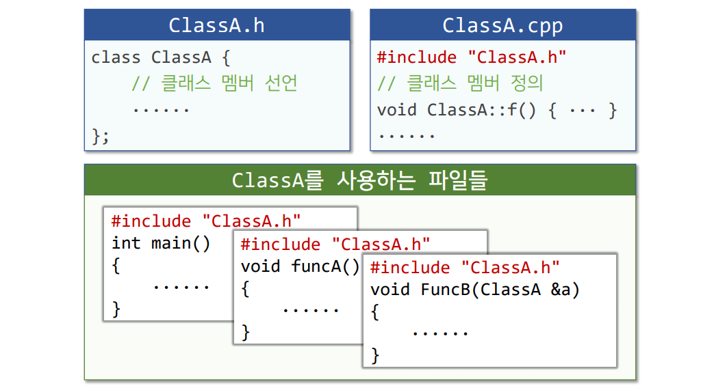

### (3) 헤더파일 내용의 중복 include 방지 (1/4)

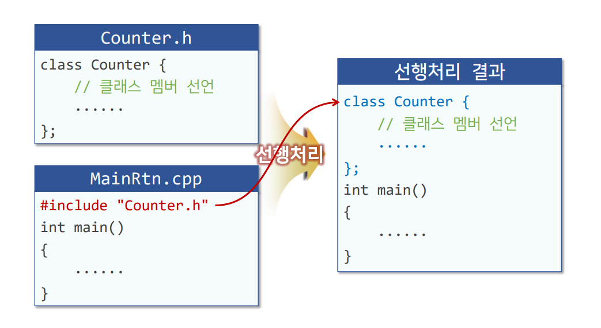

### (3) 헤더파일 내용의 중복 include 방지 (2/4)

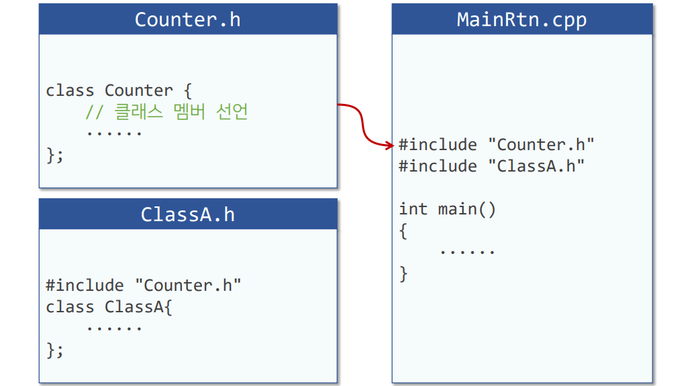

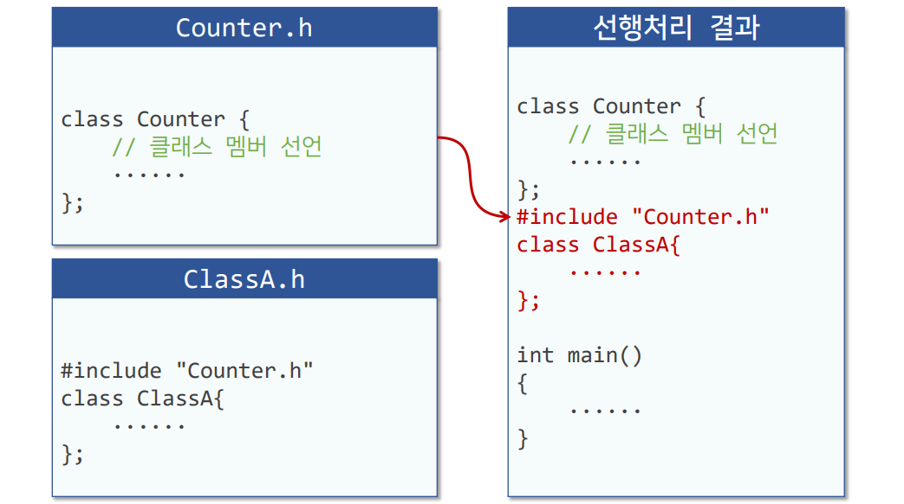

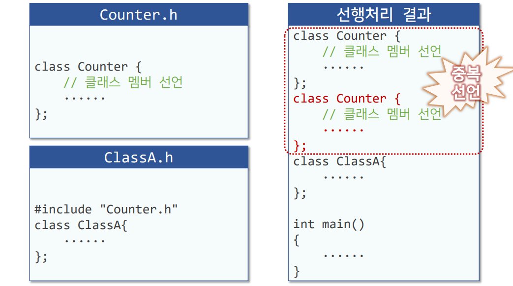

### (3) 헤더파일 내용의중복 include 방지 (3/4)

- #ifndef (if not defined) COUNTER_H_INCLUDED
  - COUNTER_H_INCLUDED 정의되어 있지 않다면.
  - #ifndef와 #endif의 사이에 있는 코드를 실행

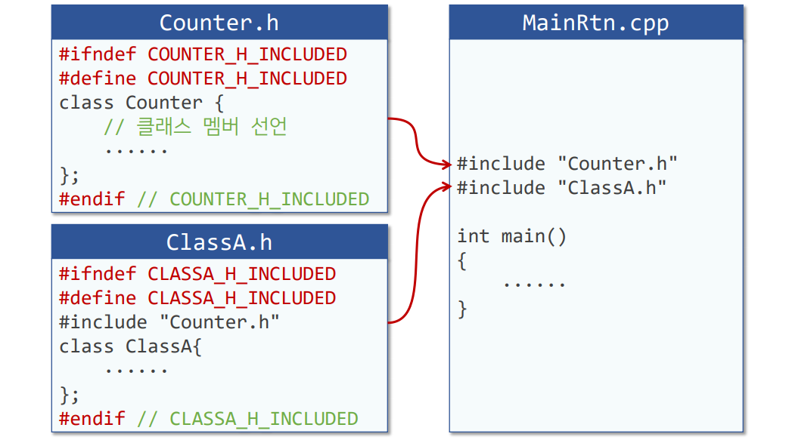

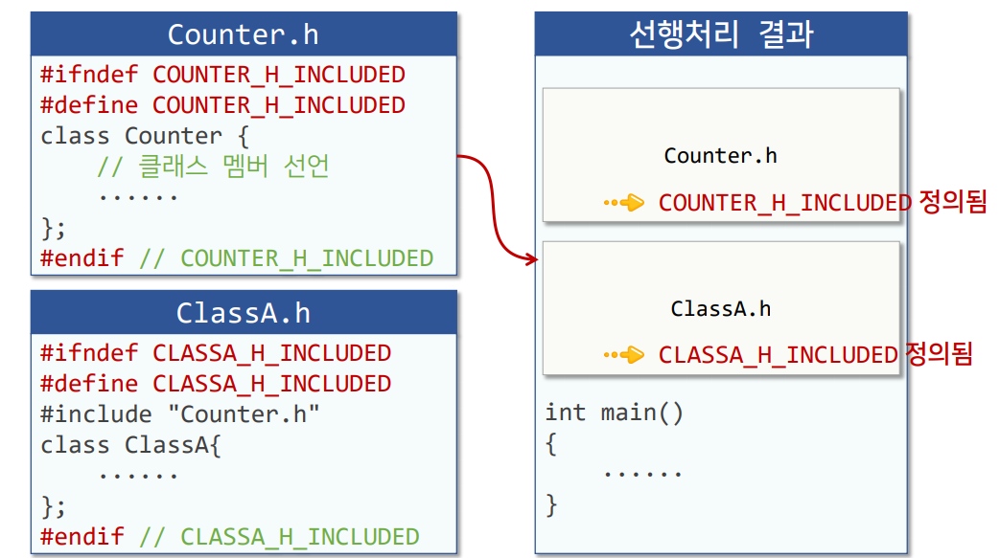

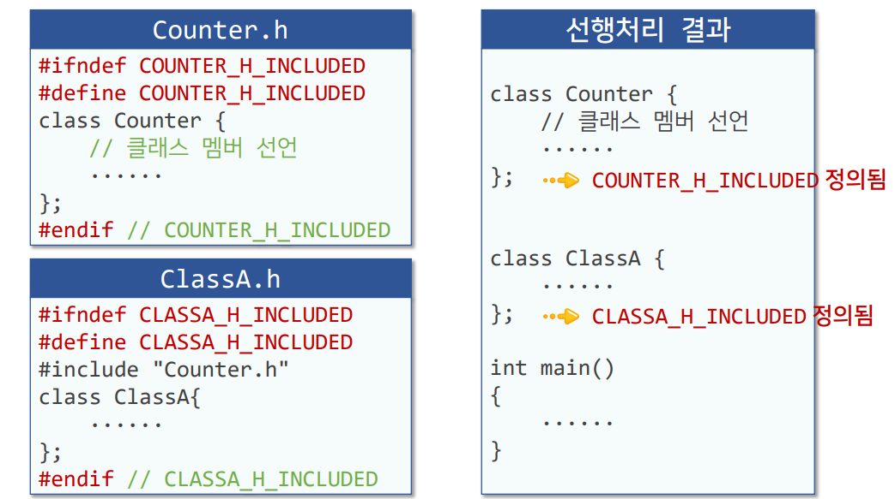

### (3) 헤더파일 내용의중복 include 방지 (4/4)

- #pragma once 선행처리 사용
  - 한 번만 번역이 되게 끔
  - 한 번만 이 header가 처리가 되게 끔 한다.
  - 현재 지원하는 컴파일러는 모두 사용 가능하지만 오래된 버전의 컴파일러는 동작하지 않을 수 있다.

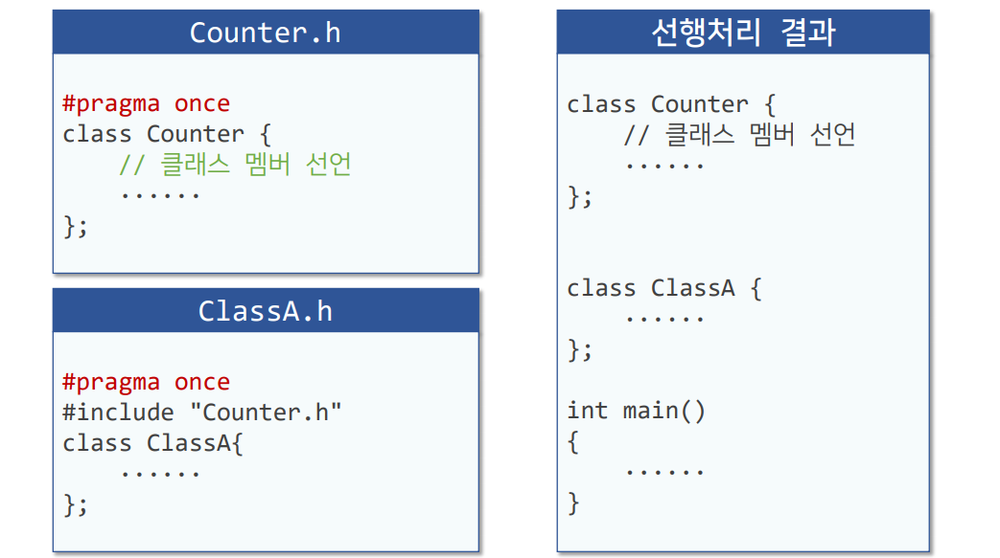


### (4) Counter 클래스의 선언 - Counter.h


### (5) Counter 객체의 정의 및 사용 - CntMain.cpp (1/2)

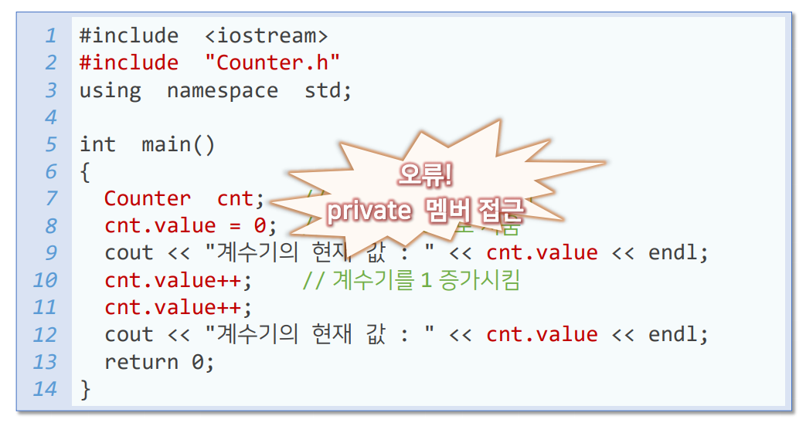

### (5) Counter 객체의 정의 및 사용 - CntMain.cpp (2/2)

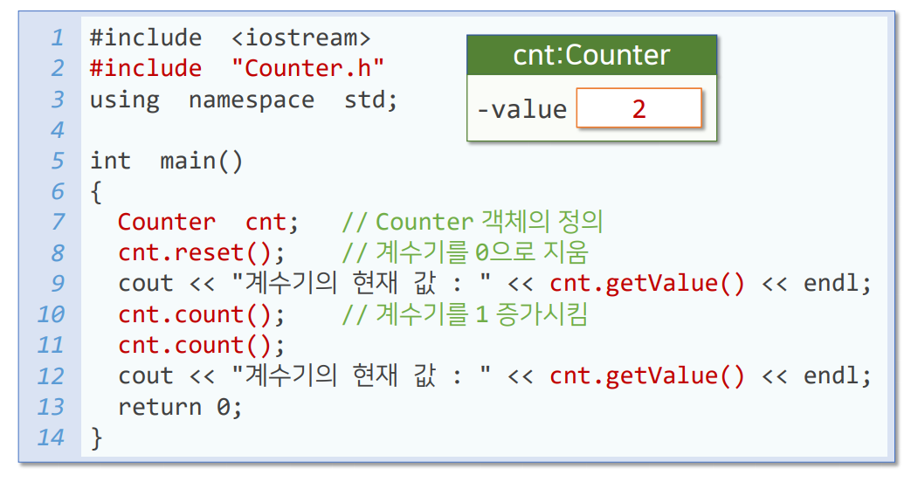


### (6) const 멤버함수 (1/2)

- 데이터 멤버의 값을 수정하지 않는 멤버함수

  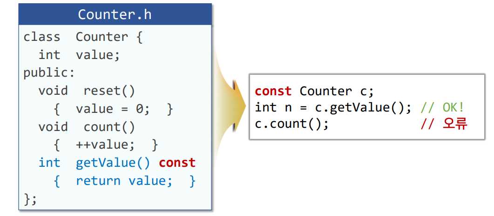

  - const는 객체 상태가 바뀌지 않는다는 걸 명시함

### (6) const 멤버함수 (2/2)

- 데이터 멤버의 값을 수정하지 않는 멤버함수

  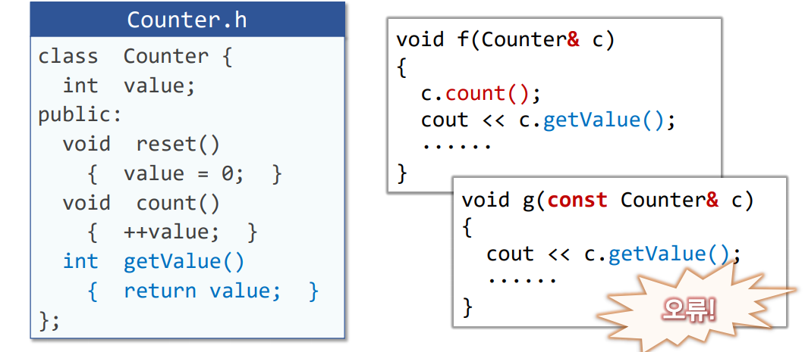

  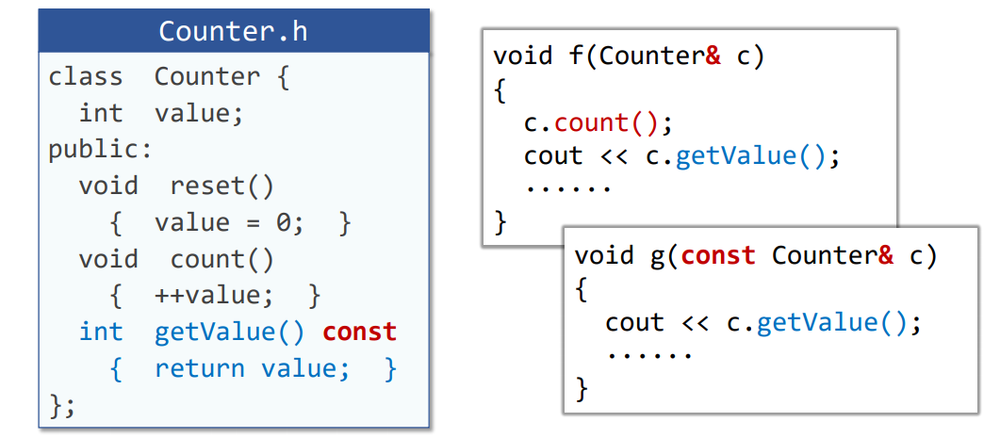

  

## 4. 생성자

### (1) 생성자 (1/2)

- 생성자(constructor)란?
  - 객체가 생성될 떄 수행할 작업을 정의하는 특수한 멤버함수
  - 매개변수를 통해 인수를 전달할 수 있으며, 다중정의를 할 수 있음
- 생성자의 특성
  - 클래스의 이름을 사용하여 선언함
  - 생성자 머리에 반환 자료형을 표시하지 않으며, return 명령으로 값을 반환할 수 없음
  - 생성자를 public으로 선언해야 클래스 외부에서 객체를 생성할 수 있음

### (1) 생성자 (2/2)

- 생성자 선언 형식

  ```c++
  class ClassName {
      ......
  public:
      className(fParameterList) {
          ...... // 객체 생성을 위한 준비 작업
      }
      ......
  };
  ```


### (2) 생성자의 예 - Counter 클래스 (1/2)

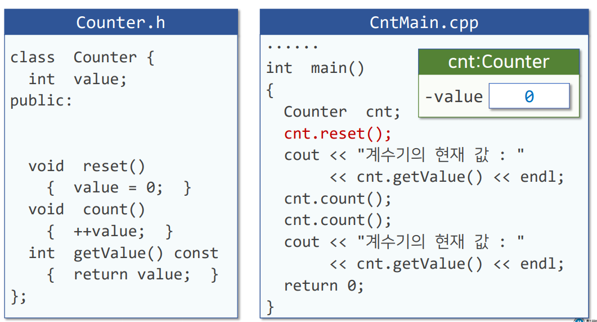

### (2) 생성자의 예 - Counter 클래스 (2/2)

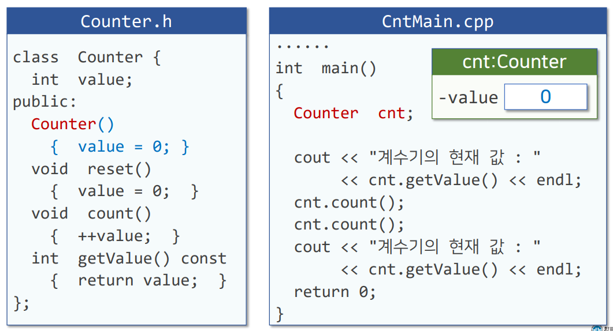


### (3) 초기화 리스트

- 초기화 리스트란?

  - 샌성자의 머리에 데이터 멤버를 초기화 하는 값들을 나열한 리스트

  - '데이터 멤버 이름{초깃값}' 형태로 초깃값을 지정

    ```c++
    class Counter {
        int value;
    public:
        Counter() : value{0} { } // 생성자, 대입 x, 초기화 o
    }
    ```

    

## 5. 소멸자

### (1) 소멸자 (1/2)

- 소멸자(destructor)란?
  - 객체가 소멸될 때 수행할 작업을 정의하는 특수한 멤버함수
- 소멸자의 특성
  - 클래스의 이름에 '~'를 붙여 선언함
  - 소멸자 머리에 반환 자료형을 표시하지 않으며, return 명령으로 값을 반환할 수 없음
  - 매개변수를 포함할 수 없음
  - 다중정의할 수 없으며, 클래스에 하나만 정의함
  - public으로 선언하는 것이 일반적임
  - 상속을 통해 파생 클래스를 정의하는 경우 virtual을 지정하여 가상함수가 되도록 하는 것이 좋음

### (1) 소멸자 (2/2)

- 소멸자 선언 형식

  ```c++
  class CLassName {
      ......
  public:
      ClassName(fParameterList) { // 생성자
          ...... // 객체 생성을 위한 준비 작업
      }
      ~ClassName() {	// 소멸자
          ...... // 객체 제거를 위한 정리 작업
      }
  };
  ```

### (2) Person 클래스의 명세

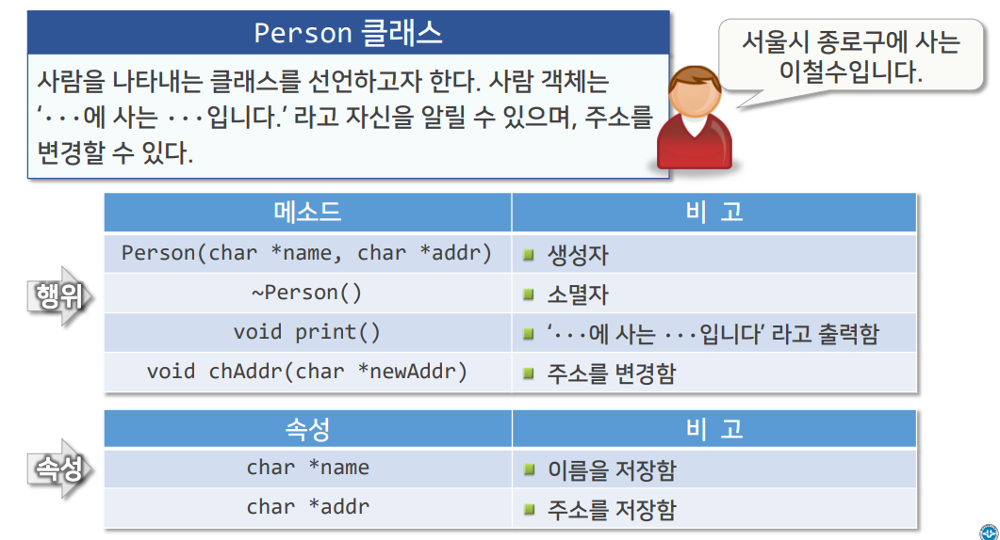

### (3) Person 클래스의 선언 - Person.h (1/6)

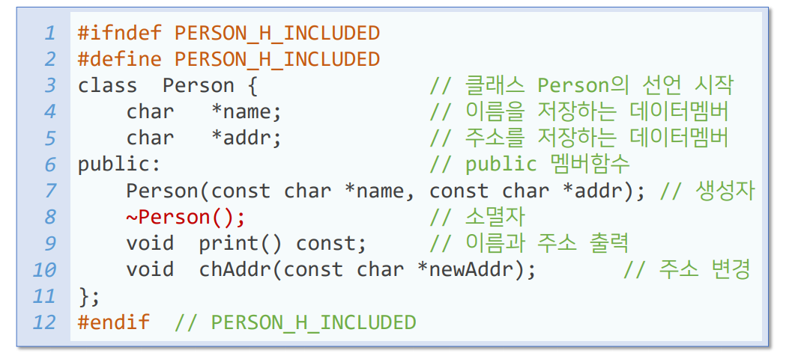

### (3) Person 클래스의 선언 - Person.cpp (2/6)

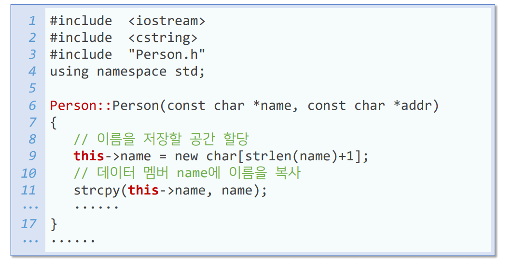

### (3) Person 클래스의 선언 - Person.cpp (3/6)

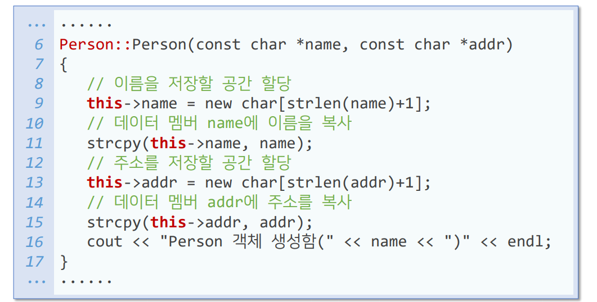

### (3) Person 클래스의 선언 - Person.cpp (4/6)

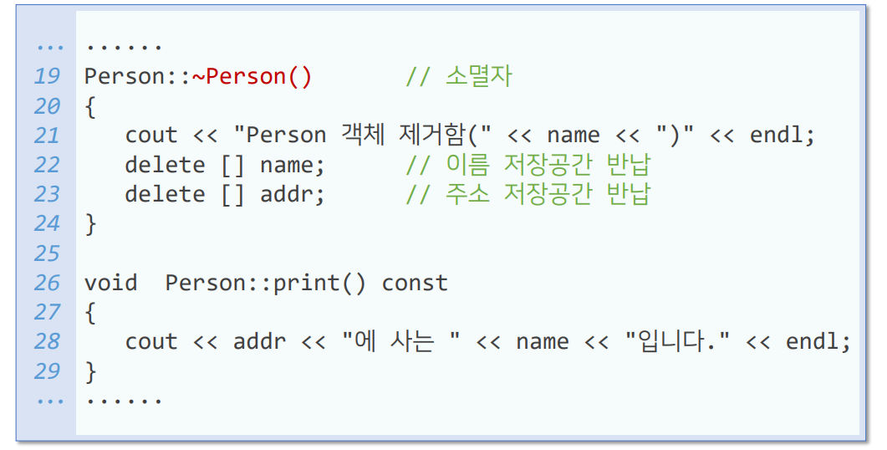

### (3) Person 클래스의 선언 - Person.cpp (5/6)

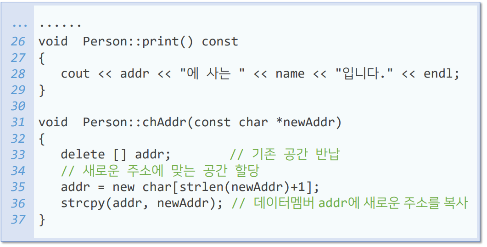

### (3) Person 클래스의 선언 - PrsnMain.cpp (6/6)

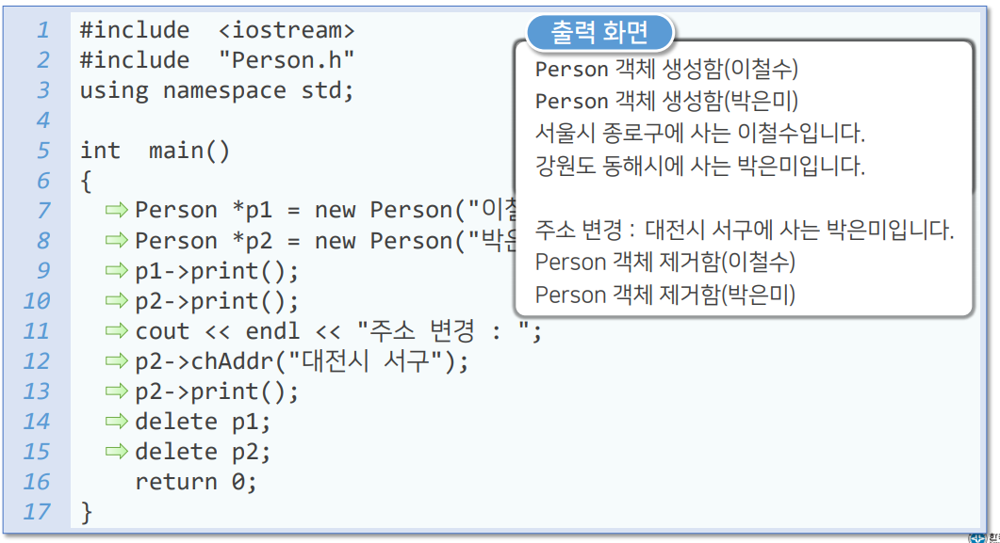


