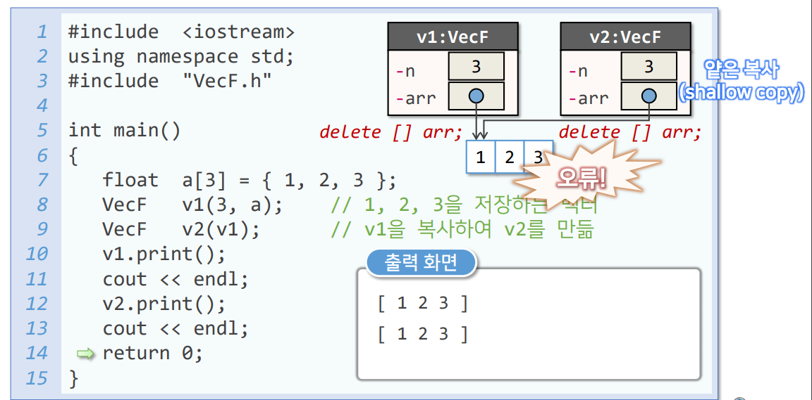
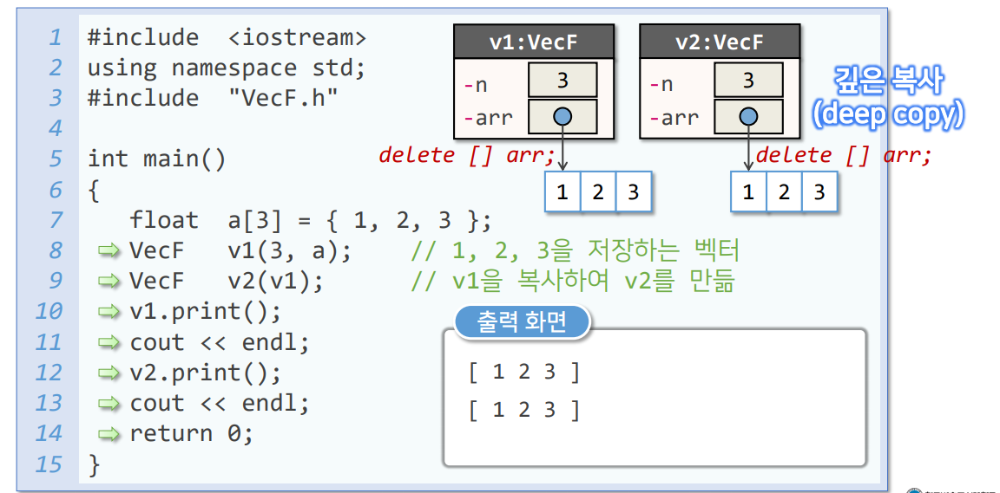
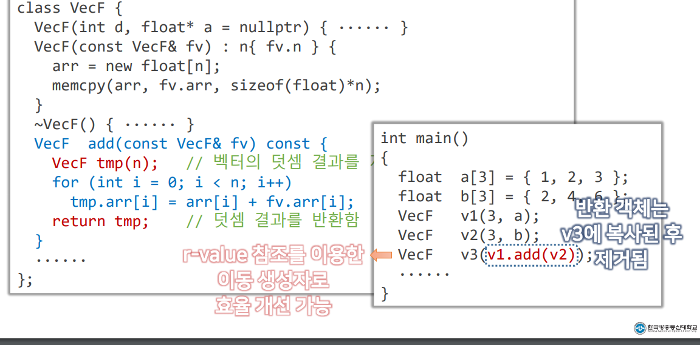
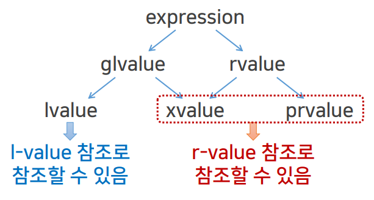
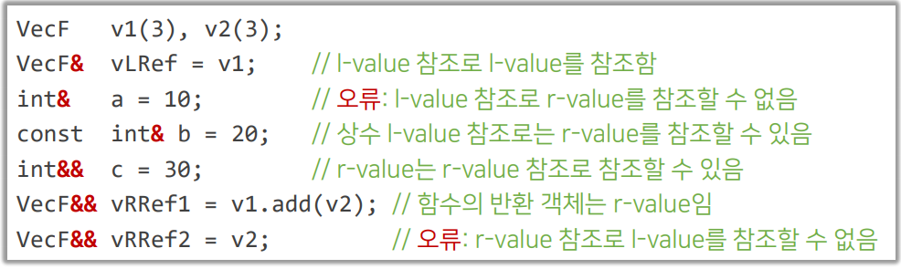
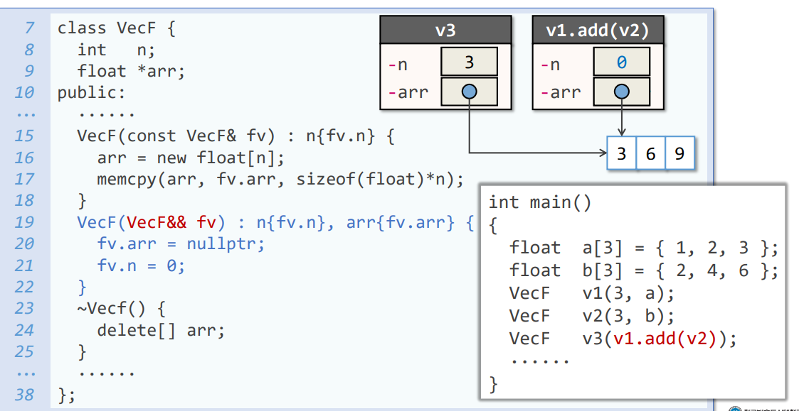
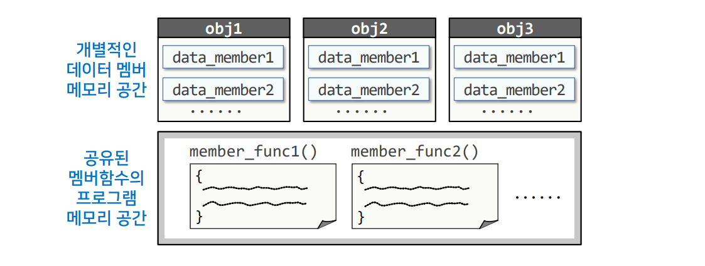
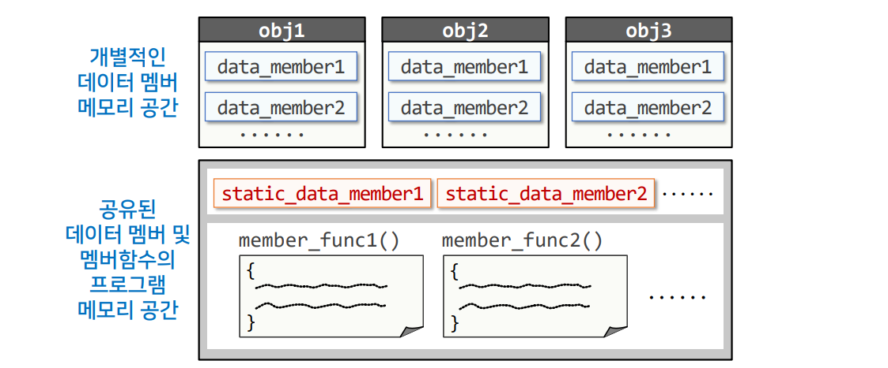
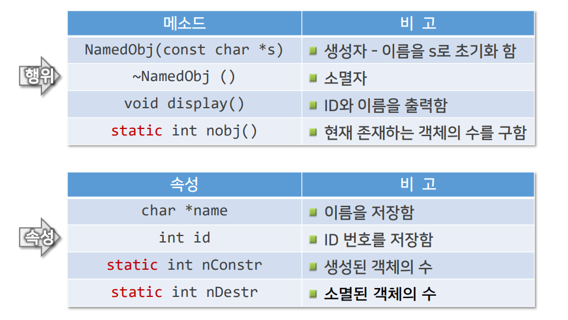

# 6강. 클래스와 객체(2)


## 1. 디폴트 생성자

### (1) 디폴트 생성자의 개념

#### 디폴트 생성자(default constructor)란?

- 매새변수가 없는 생성자, 또는 모든 매개변수에 디폴트 인수가 지정된 생성자
- 클래스를 선언할 때 생성자를 선언하지 않으면 컴파일러는 묵시적으로 디폴트 생성자를 정의함
  - 묵시적 디폴트 생성자는 아무런 처리도 포함하지 않음
- 생성자를 하나라도 선언하면 컴파일러는 묵시적 생성자를 정의하지 않음


### (2) 디폴트 생성자의 활용 (1/4)

#### 묵시적 디폴트 생성자

- Counter.h

```c++
class Counter {
    int Value;
public:
    Counter() {} // 생성자를 만들지 않아도, 묵시적으로 생성자를 생성함
    void reset() {
        value = 0;
    }
    void count() {
        ++value;
    }
    int getValue() const {
        return value;
    }
}

int main() {
    Counter cnt; // 매개변수 없이 생성 가능
    // ......
}
```


### (2) 디폴트 생성자의 활용 (2/4)

#### 디폴트 생성자가 없는 클래스

- CounterM.h

```c++
class CounterM {
    const int maxValue;
    int value;
public:
    CounterM(int mVal) 
        : maxValue{mVal}, value{0} {}
    void reset() {
        value = 0;
    }
    void count() {
        value = value < maxValue ? value + 1 : 0;
    }
    // ......
}


int main() {
    CounterM cnt1(999);
    CounterM cnt2; // error 
}
```


### (2) 디폴트 생성자의 활용 (3/4)

#### 객체 배열의 선언

- Counter.h

```c++
class Counter {
    int Value;
public:
    // Counter() {}
    void reset() {
        value = 0;
    }
    void count() {
        ++value;
    }
    int getValue() const {
        return value;
    }
}


int main() {
    Counter cntArr[4];
    Counter *pt = new Counter[10];
    // ......
}
```


### (2) 디폴트 생성자의 활용 (4/4)

#### 객체 배열의 선언

- CounterM.h

```c++
class CounterM {
    const int maxValue;
    int value;
public:
    // CounterM의 디폴트 생성자 없음
	CounterM(int mVal)
        : maxValue{mVal}, value{0} {}
    void reset {
        value = 0;
    }
    // ......
}


int main() {
    CounterM cntMArr1[3]; // Error
    CounterM cntMArr2[3] = {CounterM(9), CounterM(99), CounterM(999)}; // OK
    CounterM *pt = new CounterM[10]; // Error
    // ......
}
```


## 2. 복사 생성자


### (1) 복사 생성자의 개념 (1/2)

#### 복사 생성자(copy constructor)란?

- 같은 클래스의 객체를 복사하여 객체를 만드는 생성자
- 묵시적 복사 생성자 : 객체의 데이터 멤버들을 그대로 복사하여 객체를 만들도록 묵시적으로 정의된 복사 생성자


#### 명시적으로 복사 생성자를 정의하는 형식

```c++
class ClassName {
    ......
public:
    ClassName(const ClassName& obj) {
        ...... // 생성되는 객체에 obj를 복사하는 처리
    }
}
```


### (1) 복사 생성자의 개념 (2/2)

#### 묵시적 복사 생성자

- CounterM.h

```c++
class CounterM {
    const int maxValue;
    int value;
public:
    CounterM (int mVal) 
        : maxValue{mVal}, value{0} {}
    
    /*
    묵시적으로 해당 인스턴스를 넣으면 참조하여 해당 인스턴스의 값을 대입한다.
	CounterM(const CounterM& c) :
		maxValue{c.maxValue},
		value{c.value} {}
    */
    
    
    void reset() {
        value = 0;
    }
}


int main() {
	CounterM cnt4{99};
    CounterM cnt5{cnt4}; // 99가 초기값이 된다.
    CounterM cnt6 = cnt4; // 두번째 문장과 동일하여 99가 초기값이 된다.
}
```


### (2) 얕은 복사의 문제점 - VecF 클래스 (1/5)

#### VecF 클래스

- 벡터 객체를 만들 수 있는 VecF 클래스를 정의하고자 한다. VecF 객체는 저장할 수 있는 float 값의 수를 인수로 지정하여 생성되며, 저장할 값의 배열이 제공될 경우 그 값으로 초기화한다. 인수로 전달된 VecF 객체와 덧셈한 결과를 반환할 수 있으며, 객체에 저장된 벡터를 출력할 수 있다.
- 행위

| 메소드                   | 비고                         |
| ------------------------ | ---------------------------- |
| VecF(int d, float* a)    | 생성자                       |
| ~VecF()                  | 소멸자                       |
| VecF add(const VecF& fv) | fv와 덧셈을 한 결과를 반환함 |
| void print()             | 벡터를 출력함                |

- 속성

| 속성       | 비고                   |
| ---------- | ---------------------- |
| int n      | 벡터의 크기를 저장함   |
| float *arr | 벡터의 저장공간 포인터 |


### (2) 얕은 복사의 문제점 - VecF.h (2, 3, 4/5)

```c++
#include <iostream>
#include <cstring>
using namespace std;

class VecF {
    int n;
    float *arr;
public:
    VecF(int d, const float* a = nullptr)  : n { d } { // 생성자
        arr = new float[d];
        if(a) memcpy(arr, a, sizeof(float) * n);
    }
    
    ~VecF() {
        delete[] arr;
    }
    
    VecF add(const VecF& fv) const {
        VecF tmp(n); // 벡터의 덧셈 결과를 저장할 임시 객체
        for(int i = 0; i < n; i++) {
            tmp.arr[i] = arr[i] + fv.arr[i];
        }
        return tmp; // 덧셈 결과를 반환함
    }
    
	void print() const {
        cout << "[ ";
        for(int i = 0; i < n; i++) {
            cout << arr[i] << " ";
        }
        cout << "]";
    }
};
```

### (2) 얕은 복사의 문제점 - VFMain1.cpp (5/5)

```c++
#include <iostream>
using namespace std;
#include "VecF.h"


int main() {
    float a[3] = {1,2,3};
    VecF v1(3, a); // 1,2,3을 저장하는 벡터
    VecF v2(v1);   // v1을 복사하여 v2를 만듦
    v1.print();    // 얕은 복사로 인한 에러 발생 - 아직 v2 객체가 삭제된 메모리 영역 v1쪽을 가리키고 있음
    cout << endl;
    v2.print(); 
    cout << endl;
    return 0;
}
```





### (3) 복사 생성자의 활용 - VecF.h 수정본-1 (1, 2/2)

```c++
#include <iostream>
#include <cstring>
using namespace std;

class VecF {
    int n;
    float *arr;
public:
    VecF(int d, const float* a = nullptr)  : n { d } { // 생성자
        arr = new float[d];
        if(a) memcpy(arr, a, sizeof(float) * n);
    }
    
    VecF(const VecF& fv) : n{ fv.n } {
        arr = new float[n];
        memcpy(arr, fv.arr, sizeof(float) * n);
        
    }
    
    ~VecF() {
        delete[] arr;
    }
    
    VecF add(const VecF& fv) const {
        VecF tmp(n); // 벡터의 덧셈 결과를 저장할 임시 객체
        for(int i = 0; i < n; i++) {
            tmp.arr[i] = arr[i] + fv.arr[i];
        }
        return tmp; // 덧셈 결과를 반환함
    }
    
	void print() const {
        cout << "[ ";
        for(int i = 0; i < n; i++) {
            cout << arr[i] << " ";
        }
        cout << "]";
    }
};
```




## 3. 이동 생성자

- 복사 생성자를 사용하다보면 메모리 효율이 안좋아 질수 있다. 이럴때 이동 생성자를 사용할 수 있다.


### (1) 불필요한 복사의 비효율성

```c++
class VecF {
    int n;
    float *arr;
public:
    // ......
    VecF add(const VecF& fv) const {
        VecF tmp(n); // 벡터의 덧셈 결과를 저장할 임시 객체
        for(int i = 0; i < n; i++) {
            tmp.arr[i] = arr[i] + fv.arr[i];
        }
        return tmp; // 덧셈 결과를 반환함
    }
    // .......
};
```




### (2) r-value 참조 (1/2)

#### l-value와 r-value

```c++
a = b + 10;

// l-value = a
// r-value = b + 10;
```


#### C++11 에서 정의한 수식의 분류



- lvalue - 실체가 있는 변수, 포인터가 가리키고 있는 메모리 공간 등 저장할 수 있는 실체가 있는 것
- rvalue - 실체가 있다 하더라도 곧 사라지는 대상이거나 값을 대입하기 위한 목적인 경우
  - xvalue - 소멸될 값
  - prvalue - 상수값, 함수가 리턴하는 값 등 


### (2) r-value 참조 (2/2)

#### r-value 참조의 선언

- '&' 기호로 선언하는 l-value 참조와 달리 r-value 참조는 '&&' 기호로 선언함

#### l-value 참조와 r-value 참조의 사용 예




### (3) 이동 생성자의 개념

#### 이동 생성자(move constructor)란?

- r-value 참조로 전달된 같은 클래스의 객체의 내용을 이동하여 객체를 만드는 생성자


#### 이동 생성자의 선언 형식

```c++
class ClassName {
	......
public:
    ClassName(ClassName&& obj) {
        ...... // 생성되는 객체에 obj의 내용을 이동하는 처리
    }
}
```


### (4) 이동 생성자의 활용 - VecF.h 수정본-2 (1, 2/2)

```c++
class VecF {
    int n;
    float *arr;
public:
    ......
    VecF(const Vecf& fv) : n{fv.n} { // 복사 생성자
        arr = new float[n];
        memcpy(arr, fv.arr, sizeof(float) * n);
    }
    VecF(VecF&& fv) : n{fv.n}, arr{fv.arr} { // 이동 생성자
        fv.arr = nullptr;
        fv.n = 0;
    }
    
    ~VecF() {
        delete[] arr;
    }
    ......
}
```




## 4. static 데이터 멤버와 static 멤버함수

### (1) 객체의 메모리 공간 (1/4)

#### 객체를 저장하기 위한 메모리 공간




### (1) 객체의 메모리 공간 (2/4)

#### static 데이터 멤버

- 클래스에 속하는 모든 객체들이 공유하는 데이터 멤버
- 객체 생성과 관계없이 프로그램이 시작되면 static 데이터 멤버를 위한 메모리 공간이 할당됨
- 일반 데이터 멤버와는 달리, static 데이터 멤버는 클래스 선언문 내에서는 선언만 하고 클래스 외부에서 별도로 정의해야 함


### (1) 객체의 메모리 공간 (3/4)

#### static 데이터 멤버



- static_data_member1은 obj1, obj2, obj3 모두가 접근할 수 있다. 
- static_data_member2도 마찬가지이다.


### (1) 객체의 메모리 공간 (4/4)

#### static 멤버 함수

- 특정 객체에 대한 처리를 하는 것이 아니라, 소속 클래스 단위의 작업을 수행한느 함수
- static 멤버함수는 객체가 정의되지 않아도 사용할 수 있음
- static 멤버함수 안에서는 일반 멤버를 사용할 수 없으며, static 멤버만 사용할 수 있음


### (2) 예제 : NamedObj 클래스 (1, 2/7)

#### NamedObj 클래스

- 이름을 갖는 객체를 만들 수 있는 클래스를 정의하고자 한다. 객체가 생성될 때 고유번호를 가지게 되는데, 이 번호는 NamedObj 객체가 생성됨에 따라 1번부터 시작하여 차례로 부여되는 일련번호이다. 객체는 자기 자신의 일련번호와 이름을 출력할 수 있으며, 현재 존재하는 NamedObj 클래스의 객체 수를 구할 수 있다.




### (2) 예제 : NamedObj 클래스 - NamedObj.h (3/7)

```c++
class NamedObj {
    char *name;
    int id;
    // static 데이터 멤버
    static int nConstr; // 생성된 객체 수
    static int nDestr;  // 소멸된 객체 수
public:
    NamedObj(const char *s); // 생성자
    ~NamedObj();			 // 소멸자
    void display() const {   // 객체의 속성 출력
        cout << "ID : " << id << " --> 이름 : " << name << endl;
    }
    static int nObj() { 	 // 존재하는 객체 수 반환
        return nConstr - nDestr;
    }
};
```


### (2) 예제 : NamedObj 클래스 - NamedObj.cpp (4, 5, 6, 7/7)

```c++
#include <cstring>
#include "NamedObj.h"

NamedObj::NAmedObj(const char *s) {
    name = new char[strlen(s) + 1]; 	// 문자열을 복사할 공간을 할당
    strcpy(name, s);
    id = ++nConstr; 	// 생성된 객체의 수를 증가시키고 이를 ID로 부여
}

NamedObj::~NamedObj() {
    ++nDestr;			// 소멸될 객체의 수를 증가시킴
    delete [] name;
}

// static 데이터 멤버의 정의 및 초기화
int NamedObj::nConstr = 0;
int NamedObj::nDestr = 0;

void f() {
    NamedObj x("Third");	// 세 번째 객체의 생성
    x.display();			// 함수 반환 후 x는 소멸됨
}

int main() {
    cout << "NamedObj 클래스의 객체수 : " << NamedObj::nObj() << endl;
    NamedObj a("First");	// 첫 번째 객체 생성
    NamedObj b("Second");   // 두 번째 객체 생성
    
    f();
    
    NamedObj c("Fourth"); 	// 네 번째 객체 생성
    c.display();
    cout << "NamedObj 클래스의 객체 수" << NamedObj::nObj() << endl;
    
    return 0;
}
```


