# 7강. 클래스와 객체 (3)


## 1. 스택 클래스 - CharStack

### (1) 스택의 개념 (1, 2, 3, 4, 5, 6/6)

#### 스택(stack)이란?

- 데이터를 저장하는 자료구조의 하나
- 스택의 기본 연산
  - push : 데이터를 저장하는 연산
  - pop : 마지막으로 저장한 데이터를 인출하는 연산
    - LIFO (Last In, First Out)
- 입구와 출구가 동일하다.
- 예)
  - 'a'를 push 한다.
    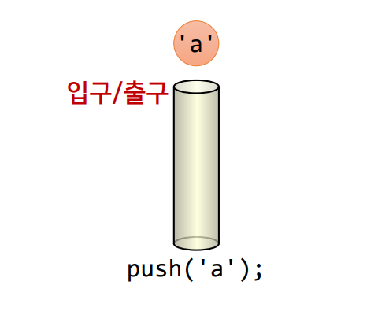
  - 'b'를 push 한다.
    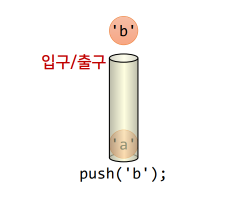
  - 'c'를 push 한다.
    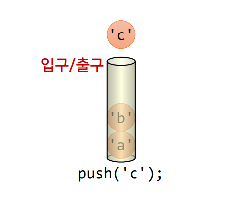
  - pop연산을 실행한다.
    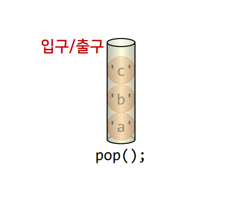
  - 스택의 내부 구조
    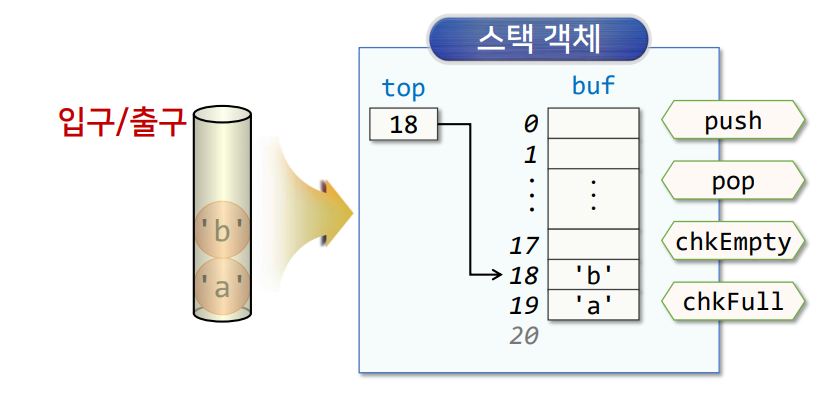


### (2) 예제 : CharStack 클래스 (1, 2/7) 

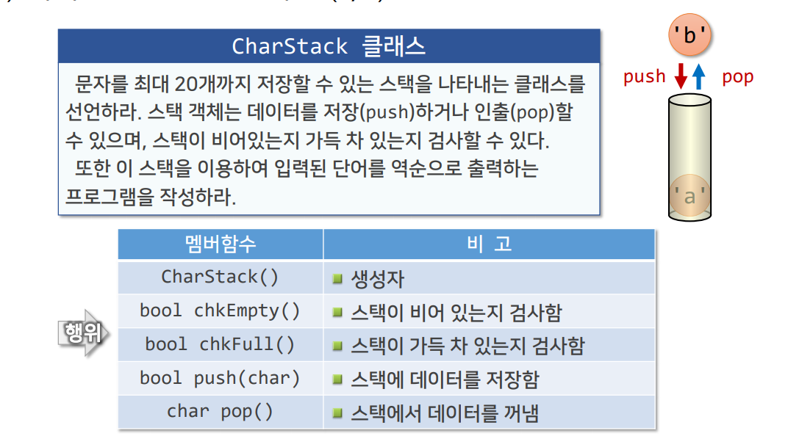

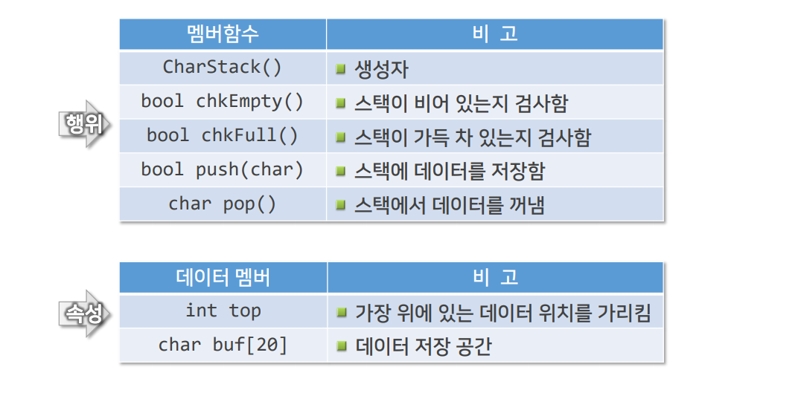


### (2) 예제 : CharStack 클래스 - CharStack.h (3/7)

```c++
class CharStack {
    enum { size = 20 };	// 스택의 크기
    int top;			// 마지막 데이터를 가리키는 포인터
    char buf[size]; 	// 스택의 저장공간
public:
    CharStack() : top{size} {} // 생성자
    
    bool chkEmpty() const { // 스택에 데이터가 없으면 true 
    	return top == size;
    }
    
    bool chkFull() const { // 스택이 가득 차 있으면 true
        return !top;
    }
    
    bool push(char ch); 	// 스택에 데이터를 넣음
    char pop(); 			// 스택에서 데이터를 꺼냄
};
```

### (2) 예제 : CharStack 클래스 - CharStack.cpp (4, 5/7)

```c++
#include <iostream>
#include "CharStack.h"
using namespace std;

bool CharStack::push(char ch) {
    if(chkFull()) {
        cout << "스택이 가득 차 있습니다." << endl;
        return false;
    }
    
    buf[--top] = ch;	// 스택에 공간이 있으면 저장
    return true;
}


char CharStack::pop() {
    if(chkEmpty()) {
        cout << "스택에 데이터가 없습니다." << endl;
        return 0;
    }
    
    return buf[top++]; 	// top 위치의 데이터 반환
}
```

### (2) 예제 : CharStack 클래스 - CSMain.cpp (6/7)

```c++
#include <iostream>
#include "charStack.h"
using namespace std;

int main() {
    CharStack chStack; // 20개의 문자를 저장할 수 있는 스택
    char str[20];
    
    cout << "영어 단어를 입력하시오 : ";
    cin >> str;
    
    char* pt = str;	// 포인터로 문자열 시작 위치를 가리킴
    while (*pt) {	// 문자열의 끝이 아니면 반복
        chStack.push(*(pt++)); 	// 스택에 문자를 넣음
    } 	
    
    cout << "역순 단어 출력 : ";
    while (!chStack.chkEmpty()) { 	// 스택이 비어 있지 않으면 반복
        cout << chStack.pop();		// 스택에서 인출한 문자를 출력
    }
    cout << endl;
    return 0;
}
```


## 2. 복소수 클래스 - Complex1

### 복소수(complex number)란?

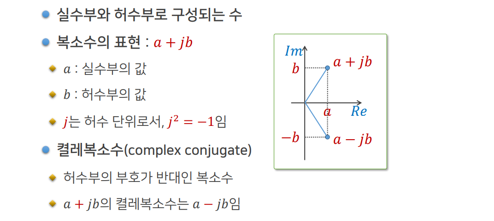


### 복소수 연산

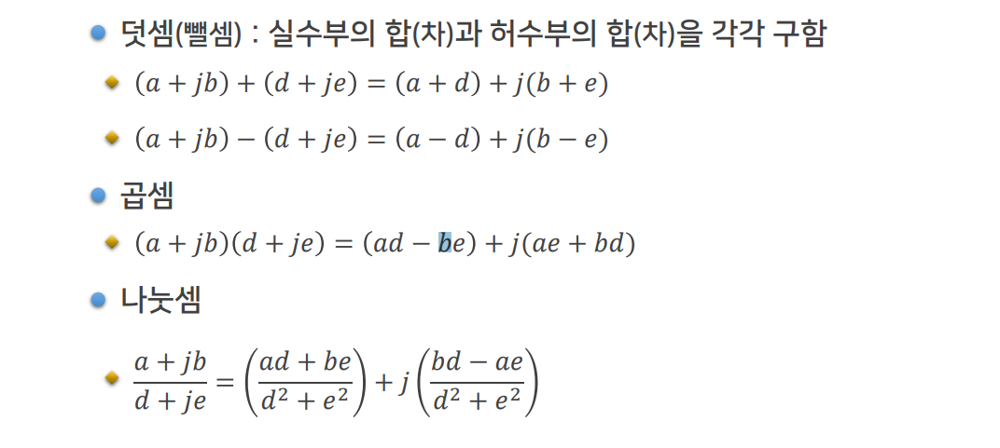


### (2) 예제 : Complex1 클래스 (1, 2/7)

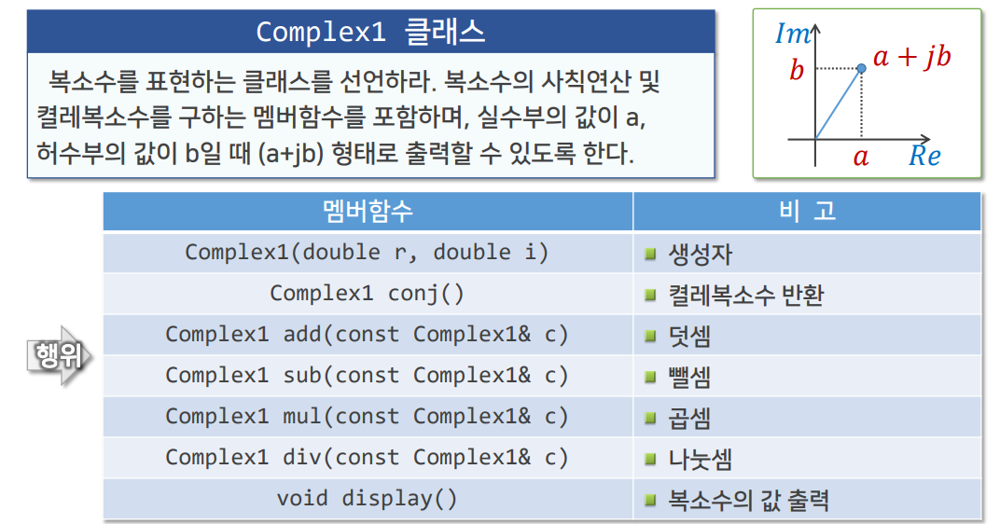

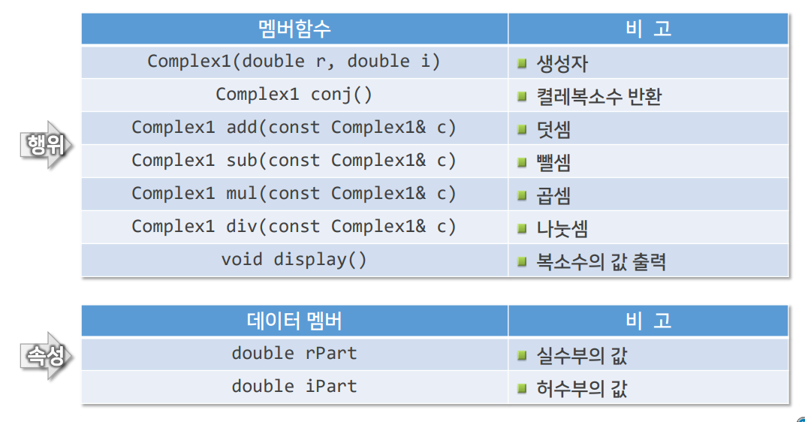


### (2) 예제 : Complex1 클래스 - Complex1.h (3/7)

```c++
class Complex1 {
    double rPart, iPart;	// 실수부 및 허수부
public:
    // 생성자
    Complex1(double r = 0, double i = 0) : rPart(r), iPart(i) {}
    Complex1 conj() const {
        return Complex1(rPart, -iPart);
    }

    Complex1 add(const Complex1& c) const {
        return Complex1(rPart + c.rPart, iPart + c.iPart);
    }

    Complex1 sub(const Complex1& c) const {
        return Complex1(rPart - c.rPart, iPart - c.iPart);
    }

    Complex1 mul(const Complex1& c) const;
    Complex1 div(const Complex1& c) const;

    void display() const;	// 복소수 값을 출력
}
```


### (2) 예제 : Complex1 클래스 - Complex1.cpp (4/7)

```c++
#include <iostream>
#include "Complex1.h"
using namespace std;

Complex1 Complex1::mul(const Complex1& c) const {
    double r = rPart * c.rPart - iPart * c.iPart;
    double i = rPart * c.rPart + iPart * c.iPart;

    return Complex1(r, i);
}

Complex1 Complex1::div(const Complex1& c) const {
    double d = rPart * c.rPart + iPart * c.iPart;
    Complex1 c1 = mul(c.conj());
    return Complex1(c1.rPart / d, c1.iPart / d);
}

void Complex1::display() const {
    cout << "(" << rPart;
    if (iPart > 0) {
        cout << "+j" << iPart;
    }
    else if (iPart < 0) {
        cout << "-j" << -iPart;
    }
    else {
        cout << ")";
    }
}
```


### (2) 예제 : Complex1 클래스 - C1Main.cpp (6/7)

```c++
#include <iostream>
#include "Complex1.h"
using namespace std;

int main() {
    Complex1 c1(1, 2);
    Complex1 c2(2, 3);
    Complex1 c3 = c1.add(c2);
    
    c1.display();
    cout << " + ";
    c2.display();
    cout << " = ";
    c3.display();
    cout << endl;
    
    c3 = c1.mul(10.0);
    c1.display();
    cout << "* 10 = ";
    c3.display();
    cout << endl;
    
    return 0;
}
```


## 3. 심화학습

### (1) 생성자 처리의 위임 (1/3)

#### 위임 생성자(delegating constructor)의 선언 (C++ 11 이후)

- 초기화 리스트에 앞서 선언된 생성자를 사용하여 새로운 생성자를 선언할 수 있음
  - 위임 생성자 : 앞서 선언된 생성자를 이용하여 선언되는 생성자
  - 타겟 생성자 : 위임의 대상이 되는 생성자
- 생성자를 작성하는 코드의 중복을 줄일 수 있음


### (1) 생성자 처리의 위임 (2/3)

#### 예 : VecF 클래스

```c++
class VecF {
    int n;
    float *arr;
public: 
    VecF(int d, const float* a = nullptr) : n { d } {
        arr = new float[d];
        if (a) memcpy(arr, a, sizeof(float) * n);
    }
    
    VecF(const VecF& fv) : n{ fv.n } {
        arr = new float[n];
        memcpy(arr, fv.arr, sizeof(float) * n);
    }
}

// ↓↓↓↓↓↓↓↓↓↓↓↓↓↓↓↓↓↓↓↓↓↓↓↓↓↓↓↓↓↓↓↓↓↓↓↓ 생성자 처리 위임 방법


class VecF {
    int n;
    float *arr;
public: 
    VecF(int d, const float* a = nullptr) : n { d } {
        arr = new float[d];
        if (a) memcpy(arr, a, sizeof(float) * n);
    }
    
    VecF(const VecF& fv) : VecF{ fv.n, fv.arr } {}
}
```


### (2) 초기화 리스트 생성자 (1/3)

#### 초기화 리스트 생성자(initializer-list constructor)란?

- 첫 번쨰 매개변수가 std::initializer_list\<Type\>인 생성자

- std::initializer_list 클래스

  - 지정된 자료형의 값들을 { } 안에 나열한 리스트

  - 헤더 파일 : #include <initializer_list>

    | 멤버함수 | 용 도                                          |
    | -------- | ---------------------------------------------- |
    | begin()  | 첫 번쨰 요소에 대한 포인터를 반환함            |
    | end()    | 마지막 요소의 다음 위치에 대한 포인터를 반환함 |
    | size()   | initialize_list의 원소 수를 반환함             |

  - 예 : initializer_list\<int\>  ilst{ 1, 2, 3 };


### (2) 초기화 리스트 생성자 (2, 3/3)

#### 초기화 리스트 생성자의 활용

```c++
class VecF {
    int n;
    float *arr;
public:
    VecF(int d, const float* a=nullptr) : n{ d } {
        arr = new float[d];
        if (a) memcpy(arr, a, sizeof(float) * n);
    }
    VecF(initializer_list<float> lst)
        : n{ static_cast<int>(lst.size()) } {
        arr = new float[n];
        copy(lst.begin(), lst.end(), arr);
    }
    ······
};

int main() {
    float a[4] = {1.0f, 2.0f, 3.0f, 4.0f};
    VecF v1(4, a);
    VecF v2{2.0f, 4.0f, 6.0f, 8.0f};
    ······
}
```


