# 8강. 연산자 다중정의 (1)


## 1. 연산자 다중정의의 개념

###  (1) 연산자 다중정의

#### 피 연산자의 자료형과 연산자

- 동일한 연산자라도 구체적인 처리 방법은 피연산자의 자료형에 따라 다름

  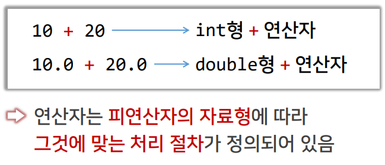


### (2) C++ 언어의 연산자 다중정의 (1/4)

- 연산자 다중정의란 ?
  - C++에 정의된 연산자를 사용자가 선언한 클래스의 객체에 대하여 사용할 수 있도록 정의 하는 것
- 연산자의 의미를 임의로 바꾸지 않는다.
- 연산자의 고유한 특성이 유지되도록 한다.
  - 연산자의 우선순위나 피연산자 수 불변
  - 전위 표기와 후위 표기 연산자의 의미 유지


### (2) C++ 언어의 연산자 다중 정의 (2/4)

- 주요 연산자 다중정의 대상
  - 클래스의 객체 간 대입 및 이동 대입 연산자
    - 특히 동적 할당을 받는 포인터를 포함하는 경우 고려할 필요가 있음
  - 수치형 객체의 산술 연산자 다중정의
    - 교환법칙도 함께 고려함
  - 두 객체를 비교하기 위한 관계 연산자의 다중정의
  - 스트림 입력 및 출력을 위한 >>, << 연산자


### (2) C++ 언어의 연산자 다중 정의 (3/4)

- 다중정의를 할 수 없는 연산자
  - 멤버 선택 연산자 (.)
  - 멤버에 대한 포인터 연산자 (.*)
  - 유효범위 결정 연산자 (::)
  - 조건 연산자 ( ? : )


### (2) C++ 언어의 연산자 다중 정의 (4/4)

- 연산자 다중정의 위치
  - 클래스의 멤버로 정의하는 방법
    - 연산자의 구현 과정에서 객체의 멤버를 액세스 할 수 있음
  - 클래스 외부에서 정의하는 방법
    - 클래스의 멤버가 아니므로, 객체의 private 멤버는 임의로 사용할 수 없음


## 2. 단항 연산자의 다중정의

### (1) 단항 연산자

- 단항 연산자란?

  - 피연산자가 1개인 연산자

  - 전위 표기법과 후위 표기법

    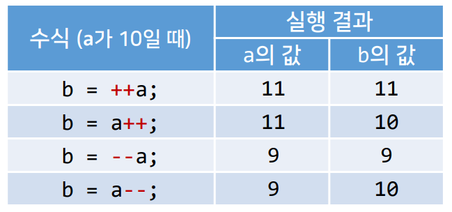

    


### (2) 전위 표기법 단항 연산자의 다중정의 (1/2)

- 다중정의 형식

  ```c++
  ReturnClass ClassName::operator opSymbol()
  {
      ......
  }
  ```

  - opSymbol : ++, -- 등의 단항 연산자 기호
  - 형식 매개변수 없음

​	

### (2) 전위 표기법 단항 연산자의 다중정의 (2/2)

- 예

  ```c++
  class IntClass1 {
  	int a;
  public:
      IntClass1 (int n = 0) : a(n) {}		// 생성자
      IntClass1& operator ++ () { 		// 전위 표기 ++ 연산자 다중 정의
          ++a;
          return *this;
      }
      int getValue() const {
          return a;
      }
  }
  ```

  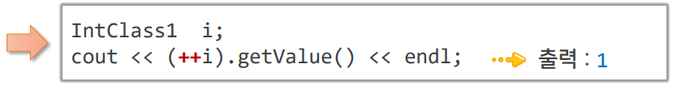


### (3) 후위 표기법 단항 연산자의 다중정의 (1/2)

- 다중정의 형식

  ```c++
  ReturnClass ClassName::operator opSymbol(int)
  {
      ......
  }
  ```

  - opSymbol : ++, -- 등의 단항 연산자 기호
  - 형식 매개변수 표기 위치의 'int'는 인수 전달의 의미가 아니라 단지 후위 표기법을 사용하는 단항 연산자임을 나타냄


### (3) 후위 표기법 단항 연산자의 다중정의 (2/2)

- 예

  ```c++
  class IntClass2 {
  	int a;
  public:
  	IntClass2(int n=0) : a(n) {} // 생성자
  	IntClass2 operator ++ (int) { // 후위 표기 ++ 연산자 다중정의
  		IntClass2 tmp(*this);
  		++a;
  		return tmp;
  	}
  	int getValue() const { 
          return a; 
      }
  };
  ```

  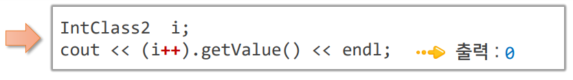

  

### (4) 예제 : Pencils 클래스 (1, 2/6)

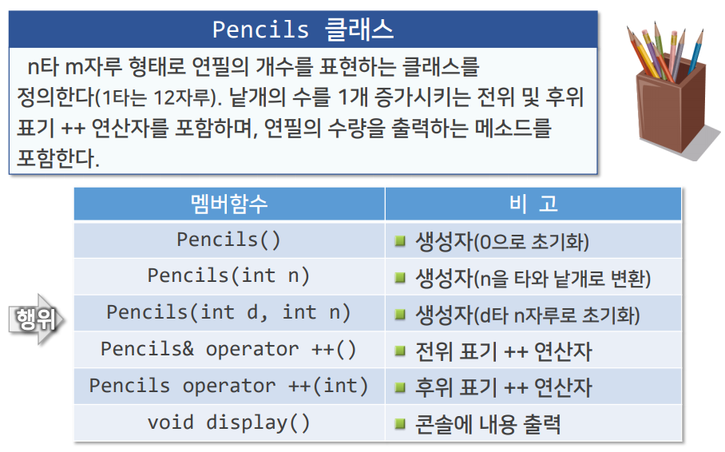

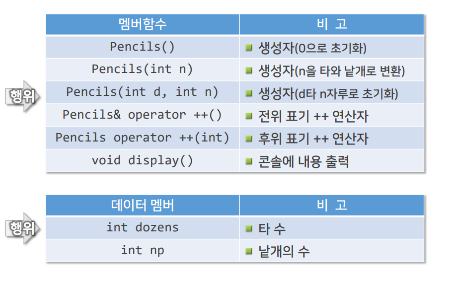


### (4) 예제 : Pencils 클래스 - Pencils.h (3/6)

```c++
#ifndef PENCILS_H_INCLUDED
#define PENCILS_H_INCLUDED
class Pencils {
    int dozens; // 타
    int np; // 낱개
public:
    Pencils() : dozens(0), np(0) {};
    Pencils(int n) { 
        dozens = n / 12; np = n % 12; 
    }
    Pencils(int d, int n) : dozens(d), np(n) {}
    
    Pencils& operator ++ ();
    Pencils operator ++ (int);
    void display() const;
};
#endif
```


### (4) 예제 : Pencils 클래스 - Pencils.cpp (4, 5/6)

```c++
#include <iostream>
#include "Pencils.h"
using namespace std;

Pencils& Pencils::operator ++() { 	// ++ 연산자(전위 표기)
    if (++np >= 12) 				// 낱개를 1 증가시킴. 결과가 12보다 크면
    	++dozens, np = 0; 			// 타 수를 1 증가시키고, 낱개는 0
    return *this; 					// 증가된 결과를 반환
}

Pencils Pencils::operator ++(int) { // ++ 연산자(후위 표기)
    Pencils tmp(*this); 			// 현재 객체를 보존
    if (++np >= 12) 				// 낱개를 1 증가시킴. 결과가 12보다 크면
    	++dozens, np = 0; 			// 타 수를 1 증가시키고, 낱개는 0
    return tmp; 					// 보존된 객체를 반환
}

void Pencils::display() const {
    if (dozens) {
    	cout << dozens << "타 ";
	    if (np) cout << np << "자루";
    		cout << endl;
    }
    else
    	cout << np << "자루" << endl;
}

```


### (4) 예제 : Pencils 클래스 - PnclMain.cpp (6/6)

```c++
int main()
{
    Pencils p1(5, 7);
    Pencils p2(23);
    
    p1.display();		// 출력 : 5타 7자루
    (++p1).display();	// 출력 : 5타 8자루
    p1.display();		// 출력 : 5타 8자루
    cout << endl;
    p2.display();		// 출력 : 1타 11자루
    p1 = p2++;
    p1.display();		// 출력 : 1타 11자루
    p2.display();		// 출력 : 2타
    return 0;
}

```


## 3. 이항 연산자의 다중정의

### (1) 이항 연산자의 다중정의

- 다중정의 형식

  ```c++
  ReturnClass ClassName::operator opSymbol(ArgClass arg)
  {
  	......
  }
  ```

  - opSymbol : +, -, *, /, &&, || 등의 이항 연산자 기호
  - 객체 자신이 좌측 피연산자, arg가 우측 피연산자에 해당됨


### (2) 예 : Complex2 클래스 (1/7)

- 복소수 객체와 복소수 객체의 덧셈 연산자

  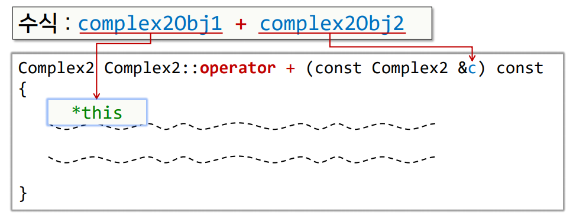


### (2) 예 : Complex2 클래스 (2/7)

- 복소수 객체와 복소수 객체의 덧셈 연산자

  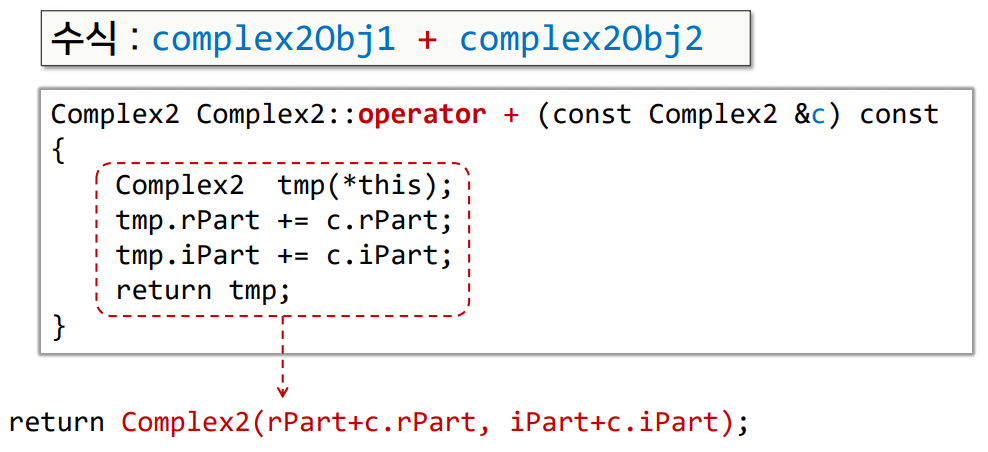

  

### (2) 예 : Complex2 클래스 (3/7)

- 복소수 객체와 실수의 덧셈 연산자

  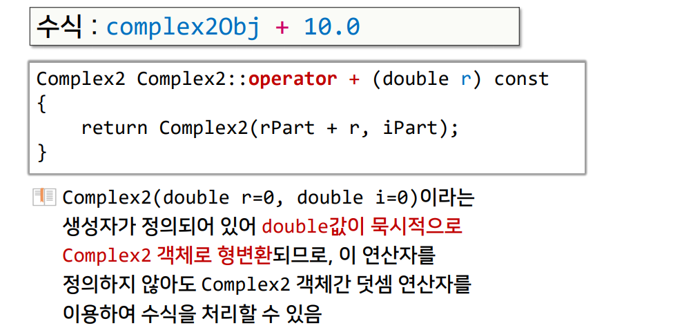


### (2) 예 : Complex2 클래스 (4, 5, 6/7)

- 실수와 복소수 객체의 덧셈 연산자

  - 좌측 피연산자가 실수이므로 Complex2 클래스의 멤버로 연산자를 정의할 수 없음

    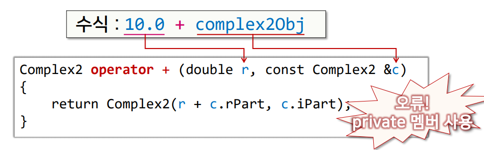

  

- 오류 해법 1 : Complex2에 private 멤버를 액세스할 수 있는 멤버함수 정의

  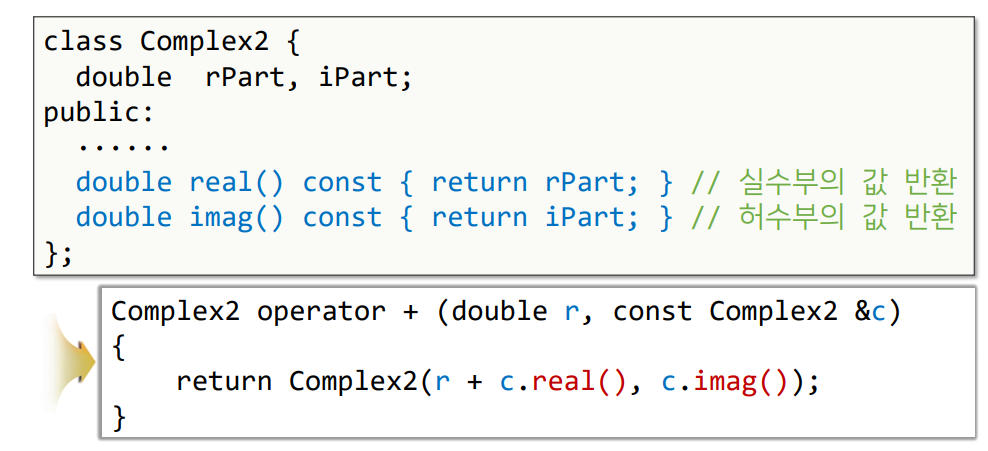


- 오류 해법 2 : Complex2에서 다중정의된 연산자를 friend로 선언

  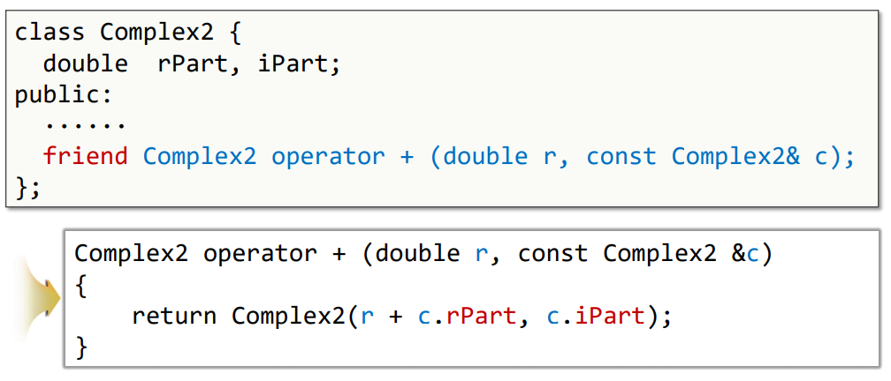

  

  

### (2) 예 : Complex2 클래스 (7/7)

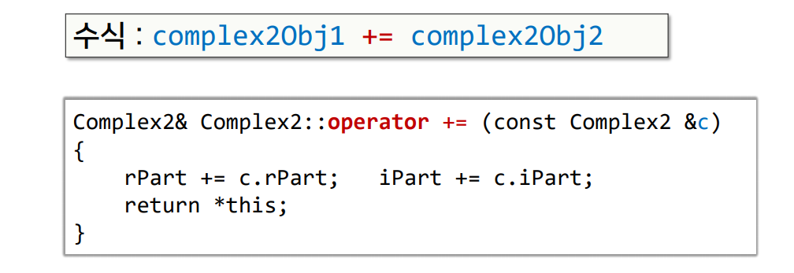


## 4. 스트림 출력 연산자의 다중정의

### (1) 스트림 출력 연산자(<<) 다중정의 (1/2)

- << 연산자를 정의할 위치

  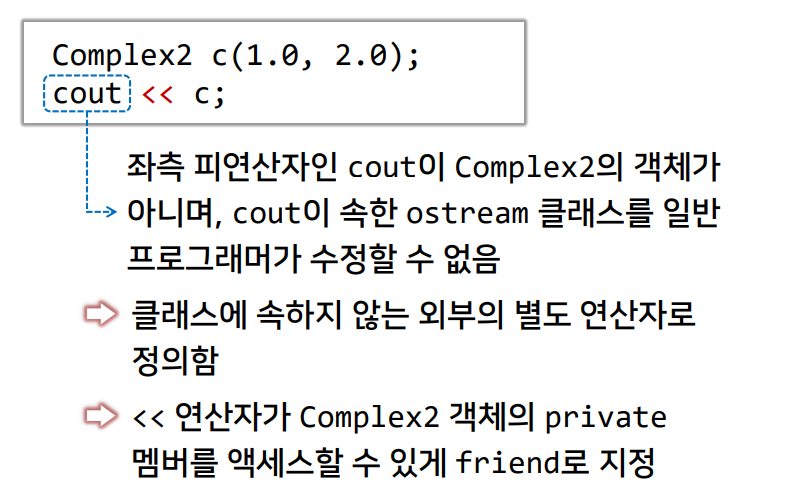

  

### (1) 스트림 출력 연산자(<<) 다중정의 (2/2)

- << 연산자가 반환할 값

  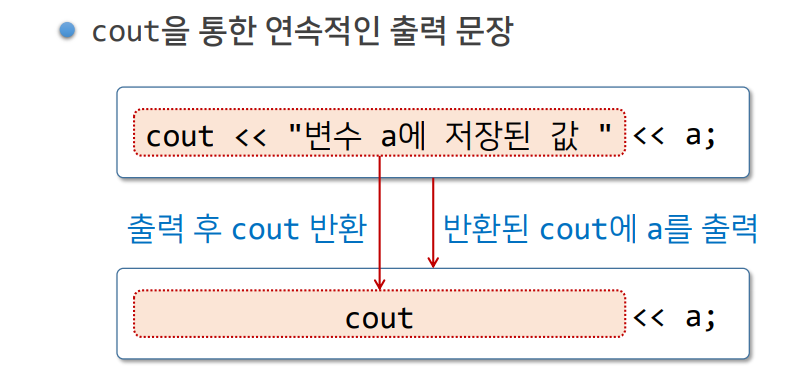

  


### (2) 스트림 출력 연산자 다중정의 예 (1/2)

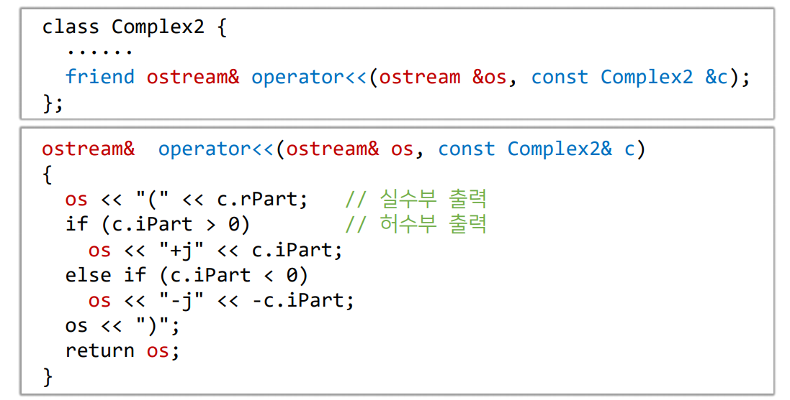


### (2) 스트림 출력 연산자 다중정의 예 (2/2)

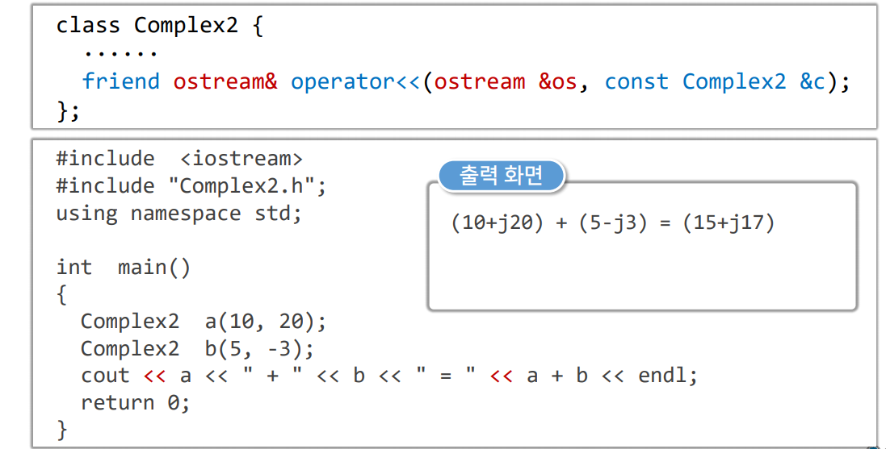


